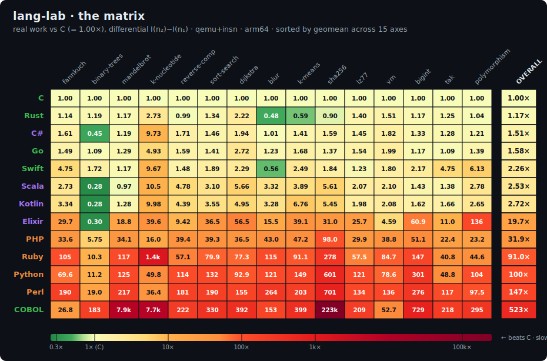
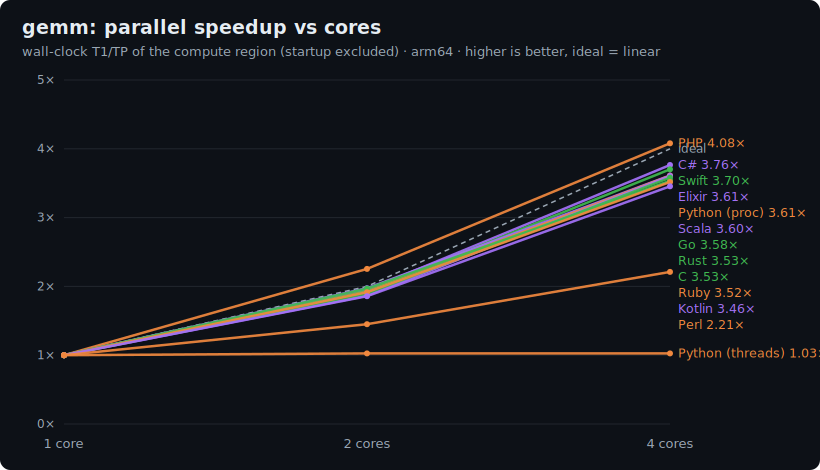

# Lang Lab

**Reproducible benchmarks for backend programming languages.**

<!-- MATRIX:START -->



_Real work each language does vs the **C baseline** (= 1.00×), as the differential `I(n₂)−I(n₁)` that cancels startup + JIT. **Lower is better** (less work than C). Geomean across all 19 axes; green cells beat or tie C. Full method below._

<details><summary><b>Leaderboard</b> (sorted by overall geomean)</summary>

| # | Language | Overall (vs C) | Fastest axis | Slowest axis |
|--:|----------|---------------:|--------------|--------------|
| 1 | **C** _(baseline)_ | **1.00×** | — | — |
| 2 | Rust | **1.04×** | message-ring 0.28× | k-nucleotide 2.73× |
| 3 | Go | **1.75×** | binary-trees 1.09× | message-ring 11.5× |
| 4 | C# | **1.81×** | binary-trees 0.45× | message-ring 35.3× |
| 5 | Swift | **2.65×** | blur 0.56× | message-ring 52.2× |
| 6 | Scala | **2.82×** | binary-trees 0.28× | message-ring 55.1× |
| 7 | Kotlin | **2.99×** | binary-trees 0.28× | message-ring 59.6× |
| 8 | Elixir | **22.6×** | binary-trees 0.30× | polymorphism 136× |
| 9 | PHP | **29.9×** | binary-trees 5.75× | sha256 98.0× |
| 10 | Ruby | **83.0×** | binary-trees 10.3× | k-nucleotide 1.4k× |
| 11 | Python | **109×** | binary-trees 11.2× | sha256 601× |
| 12 | Perl | **146×** | binary-trees 19.0× | sha256 701× |
| 13 | COBOL | **461×** | fannkuch 26.8× | sha256 223k× |

</details>

<!-- MATRIX:END -->

Lang Lab measures, **rigorously and reproducibly**, how much CPU work it costs to run
the same algorithm across backend *programming languages*. It doesn't chase the realism of
a web framework (that's [TechEmpower](https://www.techempower.com/benchmarks/)) or the
syntactic breadth of [Rosetta Code](https://rosettacode.org/). Its single differentiator is
**reproducibility** and **automatic maintenance**.

> ⚠️ Not a *human-language* lab. Lang Lab measures *programming* languages
> (Python, Go, Rust, …), it doesn't teach you to conjugate verbs.

---

## The idea in one sentence

For each language we run the same benchmark implementation inside a version-pinned Docker
image, count the **CPU instructions executed** (not wall-clock time) with a deterministic
emulator, and publish the history, all on free CI, refreshed only when a language ships a
new version.

## Why instructions, not seconds

Timing seconds on shared CI runners gives ±20-30 % noise: variable hardware, noisy
neighbours, unpredictable turbo. Instead we count the **number of instructions executed**,
which for single-threaded code is **identical on every run** regardless of machine load:
the same technique [`rustc-perf`](https://github.com/rust-lang/rustc-perf) uses to track the
Rust compiler's performance on CI.

**Honest trade-off.** Instructions ≠ wall-clock time. This metric is excellent for comparing
*algorithmic efficiency* and detecting *regressions across versions*, but it does **not**
capture real latency, parallelism, memory bandwidth, or the per-instruction cost (which
varies by ISA and microarchitecture). It is a measure of **computational work**, not absolute
speed. For parallelism specifically, the complementary
[scaling track](#scaling-track-wall-clock-parallel-speedup) measures wall-clock multicore speedup.

## Languages (12 + a C baseline)

Chosen to cover every backend **runtime archetype**, not just the popular ones, so the
methodology meets the hard runtimes early.

| Archetype | Languages |
|---|---|
| Native (no GC) | **Rust**, **Swift**, **C** (1.0× baseline), **COBOL** (GnuCOBOL→native) |
| Compiled + concurrent GC | **Go** |
| Interpreter | **Python**, **Perl**, **PHP**, **Ruby** |
| VM with JIT + GC | **Kotlin** (JVM), **Scala** (JVM), **C#** (CLR) |
| Actor VM (BEAM) | **Elixir** |

## The measurement engine

Measuring instructions **uniformly and comparably** across all those runtimes was the core
problem of the project, and it took some work.

**Backend: QEMU user-mode + the TCG `insn` plugin.** It emulates at the instruction level and
counts the *guest's* instructions. Deterministic and, within one ISA, **directly comparable**.
(valgrind/cachegrind was rejected: it segfaults on Go and measures the wrong process for
launcher runtimes.)

**The lesson.** For a while it looked like qemu *couldn't emulate* the complex runtimes
(CPython, Perl, PHP, JVM, BEAM); they all exited silently. The real cause was a harness bug,
not emulation: **qemu-user doesn't `PATH`-resolve a bare command name.** Natives were invoked
by absolute path and worked; interpreters/VMs by bare command (`python`, `java`) and failed.
Resolving `argv[0]` to an absolute path fixed it, and **all 12 measure cleanly**. Elixir needed
one extra step (its `elixir`→`erl`→`beam.smp` shell wrappers aren't ELF binaries, so we capture
and run `beam.smp` directly). *"No output" ≠ "can't emulate": verify the cause.*

Rigor rules:
- **Fixed ISA** (arm64 locally, x86_64 in CI): qemu counts the *guest's* instructions; different
  ISAs aren't comparable.
- **Metric = differential** `I(n₂) − I(n₁)`, normalized to **C = 1.0×** (**lower is better**: less
  work than C): cancels startup and JIT, isolating the algorithm's real work.
- **Jittery runtimes** (Go, C#, JVM): pinned to single-thread + GC off (`runtimeEnv`) and
  reported as **median of N**; pure natives are bit-exact.

See the [fannkuch study](benchmarks/fannkuch/README.md) for the full results and methodology.

## How it works (two pipelines, free CI)

```
endoflife.date ──► version-watch (weekly)  ──► PR bumping versions.lock.json
                                                     │ merge triggers…
                                                     ▼
                 benchmark ──► version-pinned Docker image per language
                               └► qemu+insn → results/<date>.json (history in git)
```

Everything runs on **free GitHub-hosted runners**: no self-hosted runners, no own VM, no
security exposure. The result history lives versioned in `results/`.

## Run it locally

Requires Docker.

```bash
scripts/bench-local.sh                          # every language × every benchmark
scripts/bench-local.sh rust                      # one language, all benchmarks
BENCH=binary-trees scripts/bench-local.sh rust   # one language, one benchmark
```

Each run prints one JSON line with the differential and per-size medians.

## Benchmarks

A small **suite**, chosen so each benchmark stresses a different, orthogonal axis of the
runtime. A language fast at one can be slow at another, which is exactly why one
micro-benchmark isn't enough.

| Benchmark | Axis: what it measures | Study |
|---|---|---|
| **fannkuch-redux** | Integer compute: permutations & array reversals, no allocation | [benchmarks/fannkuch](benchmarks/fannkuch/README.md) |
| **binary-trees** | Allocation + GC churn: build & walk real heap nodes, no arenas | [benchmarks/binary-trees](benchmarks/binary-trees/README.md) |
| **mandelbrot** | Floating-point: a tight IEEE-754 `double` inner loop, almost no memory traffic | [benchmarks/mandelbrot](benchmarks/mandelbrot/README.md) |
| **k-nucleotide** | Hash maps: count k-mer frequencies of a DNA string via the std dictionary | [benchmarks/k-nucleotide](benchmarks/k-nucleotide/README.md) |
| **reverse-complement** | String/byte processing: reverse-complement a DNA buffer + hash it, char by char | [benchmarks/reverse-complement](benchmarks/reverse-complement/README.md) |
| **sort-search** | Classic algorithms: hand-written quicksort + binary search over a mutable array | [benchmarks/sort-search](benchmarks/sort-search/README.md) |
| **dijkstra** | Graphs: shortest paths with a hand-written binary-heap priority queue | [benchmarks/dijkstra](benchmarks/dijkstra/README.md) |
| **blur** | Image / 2D stencil: a 3×3 Gaussian convolution over a generated grayscale image | [benchmarks/blur](benchmarks/blur/README.md) |
| **k-means** | Machine learning: integer Lloyd's clustering (nearest-centroid + floor-mean update) | [benchmarks/k-means](benchmarks/k-means/README.md) |
| **sha256** | Bit manipulation / crypto: hand-written SHA-256, applied iteratively | [benchmarks/sha256](benchmarks/sha256/README.md) |
| **lz77** | Compression: hand-written LZ77 sliding-window longest-match search | [benchmarks/lz77](benchmarks/lz77/README.md) |
| **vm** | Interpreter dispatch: a stack bytecode VM running a fixed program | [benchmarks/vm](benchmarks/vm/README.md) |
| **bigint** | Multi-precision: hand-rolled base-2³² factorial with carry propagation | [benchmarks/bigint](benchmarks/bigint/README.md) |
| **tak** | Function-call / recursion overhead: naive triple-recursive Takeuchi, no memory | [benchmarks/tak](benchmarks/tak/README.md) |
| **polymorphism** | Dynamic dispatch: megamorphic virtual calls resolved at runtime (K=6 types) | [benchmarks/polymorphism](benchmarks/polymorphism/README.md) |
| **gemm** | AI/ML — quantized int8 matrix multiply: the dominant tensor inference kernel, cache-pressure inner loop | [benchmarks/gemm](benchmarks/gemm/README.md) |
| **viterbi** | AI/ML — HMM/CRF sequence decoding: integer max-plus DP trellis + back-pointer trace | [benchmarks/viterbi](benchmarks/viterbi/README.md) |
| **gbdt** | AI/ML — gradient-boosted tree ensemble inference: data-dependent branchy tree traversal | [benchmarks/gbdt](benchmarks/gbdt/README.md) |
| **message-ring** | Concurrency overhead: per-handoff cost of a language's cooperative message-passing primitive (a 32-worker ring); N/A for Perl and COBOL | [benchmarks/message-ring](benchmarks/message-ring/README.md) |

Every benchmark has a **reference checksum** that all implementations must reproduce bit for
bit: proof that they all do exactly the same work.

**Adding a benchmark is adding source files, not rewiring the harness.** A
`benchmarks/<name>/spec.json` carries the two sizes + checksums; each image compiles *every*
benchmark via a glob, and a per-language `run` template in `languages.json` (with a `{b}`
placeholder) tells the driver how to launch it. Run one benchmark locally with
`BENCH=binary-trees scripts/bench-local.sh <lang>`.

## Scaling track (wall-clock parallel speedup)

The instruction track above is deliberately single-threaded: the qemu `insn` plugin sums guest
instructions across all cores, so it is blind to parallel speedup (a GIL-bound thread program
even looks like it scales). A separate, complementary **scaling track** answers the other
question: *given a benchmark whose algorithm is parallelizable, how well does each language let
you use multiple cores?*

It reports the **wall-clock speedup `T1/TP`** (time at 1 core over time at P cores) of the
compute region only, run **natively (no qemu)** at 1, 2 and 4 cores; **higher is better** (the
ideal is the core count). Taking a ratio cancels
machine-speed noise, so it stays stable on shared CI runners (validated to ±0.03). This track is
**not** bit-reproducible like the instruction track; it is reported as a ratio. The full fairness
rulebook (decomposition, partition, no-shared-write rules, per-language primitives) lives in
[docs/scaling-track.md](docs/scaling-track.md).

Five embarrassingly-parallel axes are measured across every language that has a concurrency
primitive (all but COBOL), each using its idiomatic real-parallel primitive (pthreads,
goroutines, fork/processes, BEAM Tasks, JVM/CLR thread pools):

| Benchmark | Speedup charts |
|---|---|
| **gemm** | [vs cores](docs/charts/gemm-scaling.svg) · [bars](docs/charts/gemm-scaling-bars.svg) |
| **mandelbrot** | [vs cores](docs/charts/mandelbrot-scaling.svg) · [bars](docs/charts/mandelbrot-scaling-bars.svg) |
| **blur** | [vs cores](docs/charts/blur-scaling.svg) · [bars](docs/charts/blur-scaling-bars.svg) |
| **k-means** | [vs cores](docs/charts/k-means-scaling.svg) · [bars](docs/charts/k-means-scaling-bars.svg) |
| **gbdt** | [vs cores](docs/charts/gbdt-scaling.svg) · [bars](docs/charts/gbdt-scaling-bars.svg) |



Most native and VM runtimes land close to the ideal (near 4× on 4 cores). The GIL/GVL languages
(Python, Ruby) reach it via processes; the thread variant flatlining at ~1.0× is the GIL made
visible, not a bug. A dedicated CI workflow (`.github/workflows/scaling.yml`) reruns the track on
x86_64 and commits the results under `results/scaling/`.

For a combined, cross-track view of concurrency per language (primitive overhead + parallel
scalability + the GIL/GVL line, with an explicit account of what is and is not measurable without
dedicated hardware), see the [concurrency study](docs/concurrency-study.md).

## Structure

```
languages/<lang>/Dockerfile      version-pinned image (compiles every benchmark)
languages/<lang>/<bench>.*       benchmark implementation (fannkuch.*, binary-trees.*, …)
languages/_base/                 shared qemu + insn-plugin base image
scripts/measure.sh               measures and emits the JSON (inside each image)
scripts/measure-scaling.sh       scaling track: wall-clock T1/TP, native, no qemu
scripts/bench-local.sh           build + measure benchmarks × languages locally
scripts/check-versions.mjs       version watcher (Node, no dependencies)
scripts/make_charts.py           SVG chart generator (no dependencies)
scripts/make_scaling_charts.py   scaling-track speedup chart generator
languages.json                   registry: endoflife slug, build-arg, runtimeKind, runtimeEnv, run
versions.lock.json               pinned version per language
scaling-config.json              scaling track: par-run templates, per-class sizes, JIT warmup
benchmarks/<name>/spec.json      sizes + reference checksums for that benchmark
benchmarks/<name>/README.md      algorithm spec, fairness rules, study
languages/<lang>/<bench>-par.*   parallel variant for the scaling track (5 axes)
results/                         instruction-track result history (versioned in git)
results/scaling/                 scaling-track results (wall-clock T1/TP per language)
docs/charts/                     generated SVG charts (instruction + scaling)
docs/scaling-track.md            scaling track: fairness rulebook
```

## Status

**v0**: 12 languages + a C baseline measured uniformly under qemu+insn across a nineteen-benchmark
suite (fannkuch, binary-trees, mandelbrot, k-nucleotide, reverse-complement, sort-search, dijkstra,
blur, k-means, sha256, lz77, vm, bigint, tak, polymorphism, gemm, viterbi, gbdt, message-ring: integer / allocation / floating-point / hash-map / string /
algorithms / graphs / image / ML / bit-manipulation / compression / interpreter-dispatch /
multi-precision / call-overhead / dynamic-dispatch / quantized-matmul / sequence-DP / tree-ensemble /
concurrency-overhead; message-ring is N/A for Perl and COBOL, which have no cooperative primitive),
the measurement engine characterized empirically, CI pipelines defined. Local, in development.

## License

[MIT](LICENSE).
