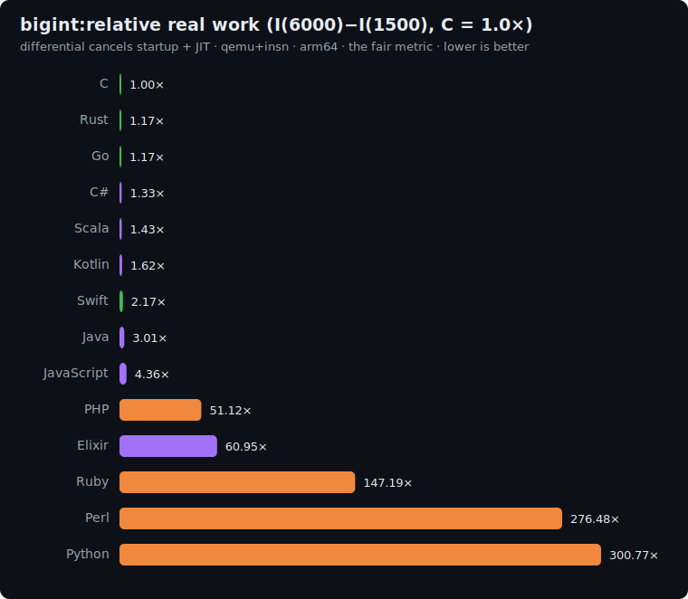

# bigint: study

The multi-precision arithmetic / carry-propagation axis. Compute `N!` as an arbitrary-precision
integer built **by hand** from an array of base-`2^32` limbs, via repeated `bignum × small-int`
multiplication, then poly-hash the limbs. The hot path is the inner limb loop: multiply, mask the
low 32 bits, **propagate the carry**, the schoolbook pattern under every big-integer library.

The twist: implementations must **hand-roll** the limb arithmetic. Languages with native
arbitrary-precision integers (Python, Perl, Elixir) may **not** use them, so this benchmark measures
the language's raw multi-word integer arithmetic, the exact inverse of [sha256](../sha256/README.md),
where *lacking* a fixed-width type was the penalty.

## The algorithm

```
P = 1000000007 ; base = 2^32

limbs = [1]                                  # least-significant limb first
for k = 2 .. N:                              # limbs *= k
    carry = 0
    for i = 0 .. len-1:
        cur = limbs[i] * k + carry           # up to ~2^46 for these N, needs a 64-bit intermediate
        limbs[i] = cur AND 0xFFFFFFFF         # low 32 bits
        carry = cur >> 32                     # high bits propagate
    while carry > 0:
        limbs[len++] = carry AND 0xFFFFFFFF ; carry = carry >> 32

h = 0
for limb in limbs: h = (h*31 + limb) mod P   # poly-hash all limbs
print h                                       # line 1
print "bigint(N)"                             # line 2
```

`N!` has `≈ N·log2(N)/32` limbs (e.g. `6000!` is ~2083 limbs), so the work scales roughly `O(N²)`.

**Correctness invariant:** every implementation prints the same hash.

| N | checksum |
|---|---|
| 1500 | `831439159` |
| 6000 | `694604666` |

## Fairness rules

1. **Hand-rolled limb arithmetic**: the explicit `limb*k + carry`, mask, carry-propagate loop above.
   **No** native/library big integers: not Python `int` arbitrary precision, not Perl `Math::BigInt`,
   not Java `BigInteger`, not Elixir's unbounded integers used *as* the bignum. The accumulator is the
   **array of 32-bit limbs** you maintain yourself.
2. **Base `2^32` limbs**: each limb is an unsigned 32-bit value; the intermediate `cur = limb*k + carry`
   is 64-bit (its product exceeds 32 bits); the low 32 bits stay, the rest carries.
3. **Exact procedure**: start `limbs = [1]`, multiply by `k = 2..N`, append carry limbs, then poly-hash
   every limb (least-significant first) `h = h*31 + limb mod 1e9+7`.
4. All integer; `cur` and the poly-hash need 64-bit (or, in masked-bignum languages, exact integers
   with `& 0xFFFFFFFF` / `>> 32`).

### Per-language limb representation

| Language | Limb array (base 2^32) |
|---|---|
| C | `uint32_t[]`, `uint64_t` intermediate |
| Rust | `Vec<u32>`, `u64` intermediate |
| Go | `[]uint32`, `uint64` |
| Swift | `[UInt32]`, `UInt64` |
| Python | `list` of ints masked `& 0xFFFFFFFF` (NOT native bignum) |
| Perl | `@array` masked `& 0xFFFFFFFF` |
| PHP | `array`, 64-bit int intermediate |
| Kotlin | `IntArray` (32-bit limbs), `Long` intermediate |
| Scala | `Array[Int]`, `Long` intermediate |
| C# | `uint[]`, `ulong` intermediate |
| Elixir | a list/`:atomics` of 32-bit limbs, masked (NOT native bignum) |

## Sizes

`n1 = 1500`, `n2 = 6000` (the factorial argument). Work scales `≈ O(N²)`, so the differential
`I(6000) − I(1500)` is dominated by the marginal multi-word multiplication.

## Results

Uniform qemu+insn pass, **arm64**, median of 5, differential `I(6000) − I(1500)` normalized to
**C = 1.0×**. Source: [`results/2026-06-17-arm64-bigint.json`](../../results/2026-06-17-arm64-bigint.json).
All 12 printed the identical `831439159` / `694604666` hashes.



| Language | I(1.5k) | I(6k) | differential | **vs C** | determinism |
|---|--:|--:|--:|--:|---|
| **C** | 1.9M | 35.2M | 33.4M | **1.00×** | exact |
| Rust | 2.3M | 41.2M | 38.9M | 1.17× | exact |
| Go | 2.4M | 41.3M | 39.0M | 1.17× | jitter |
| C# | 210.2M | 254.7M | 44.5M | 1.33× | jitter |
| Scala | 667.7M | 715.3M | 47.6M | 1.43× | jitter |
| Kotlin | 185.5M | 239.7M | 54.1M | 1.62× | jitter |
| Swift | 15.2M | 87.4M | 72.2M | 2.17× | exact |
| PHP | 125.7M | 1.8B | 1.7B | 51.12× | exact |
| Elixir | 2.1B | 4.1B | 2.0B | 60.95× | jitter |
| Ruby | 537.3M | 5.4B | 4.9B | 147.19× | jitter |
| Perl | 508.7M | 9.7B | 9.2B | 276.48× | jitter |
| Python | 533.8M | 10.6B | 10.0B | 300.77× | jitter |

The inner limb loop (`limb*k + carry`, mask, propagate) keeps the compiled and JIT'd languages within
~1.2–2.2× of C, and (as on sha256) the languages that must **mask every limb to 32 bits with an
arbitrary-precision integer** crater: Python 301×, Perl 276×. Forbidding native bignum is what makes
this fair: Python's own `int` would have made it a one-liner and hidden exactly the multi-word
arithmetic the benchmark exists to measure.

### The thirteen-axis picture: the complete suite

Differential vs C = 1.0× across all thirteen benchmarks (`fan`=fannkuch, `btr`=binary-trees,
`man`=mandelbrot, `knc`=k-nucleotide, `rvc`=reverse-complement, `srt`=sort-search, `dij`=dijkstra,
`blr`=blur, `kmn`=k-means, `sha`=sha256, `lz7`=lz77, `vm`, `big`=bigint):

| Lang | fan | btr | man | knc | rvc | srt | dij | blr | kmn | sha | lz7 | vm | big |
|---|--:|--:|--:|--:|--:|--:|--:|--:|--:|--:|--:|--:|--:|
| **Rust** | 1.14 | 1.19 | 1.17 | 2.73 | 0.99 | 1.34 | 2.22 | 0.48 | 0.59 | 0.90 | 1.40 | 1.51 | 1.17 |
| Go | 1.49 | 1.09 | 1.29 | 4.93 | 1.59 | 1.41 | 2.72 | 1.23 | 1.68 | 1.37 | 1.54 | 1.99 | 1.17 |
| C# | 1.61 | 0.45 | 1.19 | 9.73 | 1.71 | 1.46 | 1.94 | 1.01 | 1.41 | 1.59 | 1.45 | 1.82 | 1.33 |
| Swift | 4.75 | 1.72 | 1.17 | 9.67 | 1.48 | 1.89 | 2.29 | 0.56 | 2.49 | 1.84 | 1.23 | 1.80 | 2.17 |
| Scala | 2.73 | 0.28 | 0.97 | 10.53 | 4.78 | 3.10 | 5.66 | 3.32 | 3.89 | 5.61 | 2.07 | 2.10 | 1.43 |
| Kotlin | 3.34 | 0.28 | 1.28 | 9.98 | 4.39 | 3.55 | 4.95 | 3.28 | 6.76 | 5.45 | 1.98 | 2.08 | 1.62 |
| Elixir | 29.71 | 0.30 | 18.76 | 39.64 | 9.42 | 36.47 | 56.47 | 15.49 | 39.07 | 30.97 | 25.73 | 4.59 | 60.95 |
| PHP | 33.62 | 5.75 | 34.10 | 16.02 | 39.44 | 39.28 | 36.54 | 43.03 | 47.18 | 98.02 | 29.89 | 38.76 | 51.12 |
| Ruby | 104.64 | 10.34 | 117.20 | 1437.92 | 57.08 | 79.91 | 77.28 | 115.20 | 91.12 | 278.14 | 57.52 | 84.66 | 147.19 |
| Python | 69.57 | 11.15 | 124.76 | 49.80 | 114.00 | 131.93 | 92.92 | 120.91 | 149.26 | 600.64 | 120.84 | 78.57 | 300.77 |
| Perl | 189.62 | 18.98 | 216.87 | 36.40 | 181.17 | 189.53 | 155.46 | 264.40 | 203.14 | 701.29 | 133.54 | 135.53 | 276.48 |

Thirteen benchmarks, thirteen orderings of the same twelve languages: the final word of the project.

- **No language is fast or slow; each is fast or slow at a kind of work.** A single row spans up to
  ~50× (Rust 0.48×–2.73×) for the fast languages and over ~50× for the slow ones (Elixir 0.30×–60.95×;
  Python 11.15×–600.64×; Ruby 10.34×–1437.92×, whose top end is the largest single cell anywhere).
  Collapsing that to one number is the mistake the suite was built to expose.
- **Rust** beats C on four axes and never exceeds 2.73×, the only language that is never a wrong
  default. **C#** is the most balanced managed runtime. **The JVM** is an allocation specialist.
  **Elixir** is the widest-range language of all, best-in-class at functional dispatch and allocation,
  worst at in-place arrays, graphs and bignum. **Python and Perl** collapse specifically when denied a
  fixed-width integer (sha256, bigint). **Ruby** is the most lopsided interpreter: competitive with
  Python and PHP on most axes, then the single worst cell in the suite on k-nucleotide (1437.92×),
  where its string-keyed `Hash` is the hot path. **Each language has a fingerprint, not a rank.**

**There is no scalar "speed of a language." Thirteen axes prove it.**

## Reproduce

```bash
BENCH=bigint scripts/bench-local.sh <lang>
```
