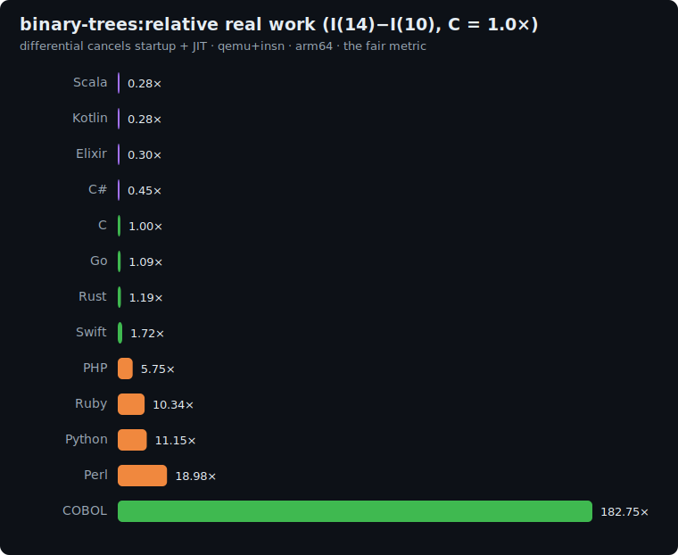

# binary-trees: study

Allocation/GC benchmark from the
[Computer Language Benchmarks Game](https://benchmarksgame-team.pages.debian.net/benchmarksgame/description/binarytrees.html).
It is the complement to [fannkuch](../fannkuch/README.md): fannkuch is pure integer compute,
binary-trees is **memory allocation + garbage collection**. A language fast at one can be slow
at the other. That contrast is the point of having both.

## The algorithm

Build complete binary trees out of **real heap-allocated nodes**, then walk them counting nodes.
`check(node)` returns `1` at a leaf and `1 + check(left) + check(right)` otherwise (the node count).
With `min_depth = 4` and `max_depth = max(min_depth+2, n)`:

1. Allocate + `check` one **stretch tree** of depth `max_depth + 1`.
2. Allocate one **long-lived tree** of depth `max_depth`, held alive across the whole loop (this
   forces the GC to keep an old object live while churning short-lived ones).
3. For `depth = min_depth, min_depth+2, …, max_depth`: build `2^(max_depth - depth + min_depth)`
   trees of that depth and sum their `check`.
4. Add the long-lived tree's `check`.

Print the **single aggregate total** (sum of all node counts) on line 1; `binary-trees(n)` on line 2.

**Correctness invariant:** every implementation must print the same total, the proof they all
build and walk the same trees.

| n (depth) | checksum |
|---|---|
| 10 | `135854` |
| 14 | `3222190` |

## Fairness rules

The benchmark measures the **allocator/GC**, so the rules protect that:

1. **Every node is a real heap allocation** with two child references, made the idiomatic way for
   the language (object, `Box`/heap struct, pointer struct, record). **No** node pools, arenas,
   bump allocators, flat-array encodings, or struct-of-arrays.
2. **No analytic shortcut.** A full tree of depth `d` has `2^(d+1)-1` nodes; computing the total
   arithmetically instead of building + walking the tree is a disqualifying cheat.
3. **Build then traverse** as distinct phases; don't fuse `make` and `check` to avoid
   materializing the tree.
4. **Same shape parameters** across all languages (`min_depth=4`, the stretch/long-lived/loop
   structure above).
5. **Idiomatic allocation, not forced uniformity**: each language allocates its natural node type;
   the per-language representation is documented below so the "language vs implementation" critique
   is pre-empted.

### Per-language node representation

Each language allocates its **natural** node type, documented here so the result reflects the
language's idiomatic allocator, not a forced-uniform encoding.

| Language | Node representation | Memory management |
|---|---|---|
| C | `struct Node { Node *left, *right; }` via `malloc` | manual `free` (tree destroyed) |
| Rust | `struct Node { left, right: Option<Box<Node>> }` | RAII drop (deterministic) |
| Go | `*Node` pointer struct | tracing GC |
| Swift | `final class Node` | ARC (reference counting) |
| Python | `class Node` with `__slots__` | refcount + cyclic GC |
| Perl | 2-element array ref `[left, right]` | refcount |
| PHP | `class Node` | refcount + cyclic GC |
| Kotlin | `class Node(left, right)` | JVM heap, tracing GC |
| Scala | `final class Node` | JVM heap, tracing GC |
| C# | `sealed class Node` | CLR heap, generational GC |
| Elixir | 2-tuple `{left, right}` | BEAM per-process heap, copying GC |
| Ruby | `class Node` with `left`/`right` accessors | MRI heap, mark-and-sweep GC |

### Runtime GC configuration during measurement

Because this axis exists to measure collection work, the pinned runtime configurations matter and
are stated here (the full table lives in the main README's "Runtime configuration" section):
every garbage collector is **on**. Go runs its default GC (`GOGC=100`) on the single measured
thread; Kotlin/Scala run `-XX:+UseSerialGC` (a collecting GC, chosen so the work lands on the
measured thread instead of concurrent GC threads the instruction counter would count
nondeterministically); C# runs the workstation GC. What the pinning changes is *where* GC work
runs and how deterministic the count is, not *whether* collection happens.

## Sizes

`n1 = 10`, `n2 = 14` (tree depth). Allocation cost is exponential in depth, so the differential
`I(14) − I(10)` is dominated by the marginal allocation/GC work while cancelling startup. Tunable
down to `8/12` if the slow interpreters/BEAM are too slow under qemu.

## Results

Uniform qemu+insn pass, **arm64**, median of 5, differential `I(14) − I(10)` normalized to
**C = 1.0×**. Source: [`results/2026-06-17-arm64-binary-trees.json`](../../results/2026-06-17-arm64-binary-trees.json).



| Language | I(10) | I(14) | differential | **vs C** (lower is better) | determinism |
|---|--:|--:|--:|--:|---|
| Scala | 647.8M | 860.6M | 212.8M | **0.28×** | jitter |
| Kotlin | 185.6M | 399.4M | 213.8M | **0.28×** | jitter |
| Elixir | 1.98B | 2.21B | 227.3M | **0.30×** | jitter |
| C# | 220.7M | 565.4M | 344.7M | **0.45×** | jitter |
| **C** | 33.7M | 800.4M | 766.7M | **1.00×** | exact |
| Go | 36.9M | 871.3M | 834.4M | 1.09× | jitter |
| Rust | 40.2M | 949.3M | 909.0M | 1.19× | exact |
| Swift | 69.5M | 1.39B | 1.32B | 1.72× | exact |
| PHP | 226.3M | 4.64B | 4.41B | 5.75× | exact |
| Ruby | 625.7M | 8.55B | 7.93B | 10.34× | jitter |
| Python | 399.7M | 8.95B | 8.55B | 11.15× | jitter |
| Perl | 651.7M | 15.2B | 14.5B | 18.98× | jitter |

### The headline: managed runtimes *beat* C at allocation

This is the inverse of fannkuch. On binary-trees the **JVM (Scala/Kotlin 0.28×), the BEAM
(Elixir 0.30×), and the CLR (C# 0.45×) all do *less* marginal work than C**, because allocating
a short-lived node is a **bump-pointer** in a generational/copying nursery, while C pays a full
`malloc` *and* a `free` per node. The benchmark's fairness rules forbid arenas precisely so this
shows: idiomatic manual memory management is genuinely expensive for high-churn allocation, and a
good GC amortizes it. Go (1.09×) lands next to C; the two non-GC natives that still box every node,
Rust (1.19×, a `Box` + drop per node) and Swift (1.72×, ARC retain/release), sit just above.
The interpreters pay per-object overhead and blow up: PHP 5.75×, Python 11.15×, Perl 18.98×.

### Elixir: huge *absolute* cost, cheap *marginal* cost

Elixir's differential (0.30×) looks great, but its **absolute** count is enormous: **1.98B
instructions already at n=10** (see [the absolute chart](../../docs/charts/binary-trees-n2-absolute.svg)),
~50× C's 33.7M. That constant is BEAM startup + scheduler/reduction overhead, present at *both*
sizes; the differential **cancels it** and exposes that the BEAM's copying collector makes the
*marginal* tree cheap. The two charts tell complementary stories: the differential is the fair
measure of the algorithm's work; the absolute count is what you actually pay to run it.

### Why this benchmark earns its place

Compared head-to-head with [fannkuch](../fannkuch/README.md) (pure compute, zero allocation), the
ranking **reorders dramatically**: a language's standing is workload-dependent, which is the entire
argument for a suite rather than one micro-benchmark:

| Language | fannkuch (compute) | binary-trees (allocation) | swing |
|---|--:|--:|--:|
| Kotlin | 3.34× | 0.28× | **12× cheaper** |
| Scala | 2.73× | 0.28× | ~10× cheaper |
| Elixir | 29.71× | 0.30× | **~100× cheaper** |
| C# | 1.61× | 0.45× | ~4× cheaper |
| Rust | 1.14× | 1.19× | ~flat |
| Go | 1.49× | 1.09× | ~flat |
| Swift | 3.42× | 1.72× | cheaper |
| Python | 69.57× | 11.15× | cheaper |
| Perl | 189.62× | 18.98× | cheaper |

A pure-compute benchmark says Kotlin costs 3.3× a C program; an allocation benchmark says it costs
0.28×. Neither is "the" answer; they measure different work. That is the point.

## Reproduce

```bash
BENCH=binary-trees scripts/bench-local.sh <lang>
```
