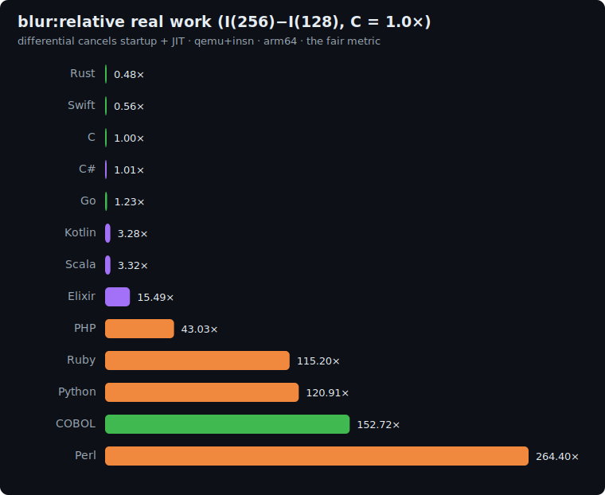

# blur: study

The image / 2D-stencil axis of the suite. A 3×3 Gaussian blur applied to a generated grayscale
image: the bread and butter of image processing, and a memory-access shape none of the other
benchmarks have: a **sliding window over a 2D buffer**, reading each pixel's neighbours, in tight
doubly-nested loops. Where [mandelbrot](../mandelbrot/README.md) is also a 2D grid, its pixels are
*independent*; here every output pixel depends on its **neighbourhood**, which is the whole point.

## The algorithm

```
P = 1000000007 ; PASSES = 4 ; kernel K = [1 2 1 ; 2 4 2 ; 1 2 1]  (sum 16)

# 1. Generate an N x N grayscale image (pixels 0..255) with the pinned integer LCG
state = 42
for k in 0..N*N-1:
    state = (state*1103515245 + 12345) AND 0x7fffffff
    src[k] = state mod 256

# 2. Apply the 3x3 blur PASSES times, double-buffered, clamping at the edges
repeat PASSES times:
    for i in 0..N-1:
        for j in 0..N-1:
            acc = 0
            for di in -1..1:
                ni = clamp(i+di, 0, N-1)          # edge replication
                for dj in -1..1:
                    nj = clamp(j+dj, 0, N-1)
                    acc += K[di+1][dj+1] * src[ni*N + nj]
            dst[i*N + j] = acc / 16                 # INTEGER division
    swap(src, dst)                                  # next pass reads the result

# 3. Checksum: polynomial hash of the final image (row-major; src holds it after the last swap)
h = 0
for k in 0..N*N-1:
    h = (h*31 + src[k]) mod P
print h                                             # line 1
print "blur(N)"                                     # line 2
```

Each pass keeps pixels in `0..255` (`16·255 / 16 = 255`), so the buffers never overflow even a
32-bit int; only the hash needs 64-bit. `clamp` (edge replication) gives every pixel (borders
included) a full 3×3 window, so there is no special-cased border.

**Correctness invariant:** every implementation prints the same hash.

| N | checksum |
|---|---|
| 128 | `722869223` |
| 256 | `229750350` |

## Fairness rules

1. **Hand-written nested stencil loop**: the explicit `di/dj` neighbourhood sum above. **No**
   image library, no FFT-based convolution, no `scipy`/`PIL`/`ImageMagick`/SIMD-intrinsic shortcut.
2. **Two mutable buffers** (double-buffering); the pass reads `src`, writes `dst`, then swaps.
3. **Same kernel, PASSES = 4, clamp edges, row-major `i*N+j` indexing**, and the exact LCG /
   `mod 256` image generation.
4. **Integer arithmetic** throughout: the `acc / 16` is integer (floor) division (Python `//`, Perl
   `int()`, Elixir `div`); the hash `h*31 + pixel` is 64-bit (`h*31` ≈ 3.1e10). No floating point.

### Per-language buffer representation

| Language | Image buffers |
|---|---|
| C | two `int[]` |
| Rust | two `Vec<i32>` |
| Go | two `[]int32` |
| Swift | two `[Int]` |
| Python | two `list` |
| Perl | two `@array` |
| PHP | two `array` |
| Kotlin | two `IntArray` |
| Scala | two `Array[Int]` |
| C# | two `int[]` |
| Elixir | two `:atomics` (flat N·N 64-bit arrays; swap the refs) |
| Ruby | two `Array` (flat N·N; swap the refs via parallel assignment) |

## Sizes

`n1 = 128`, `n2 = 256` (image edge). Work is `PASSES · 9 · N²`, so the differential
`I(256) − I(128)` is dominated by the marginal stencil work while cancelling startup.

## Results

Uniform qemu+insn pass, **arm64**, median of 5, differential `I(256) − I(128)` normalized to
**C = 1.0×**. Source: [`results/2026-06-17-arm64-blur.json`](../../results/2026-06-17-arm64-blur.json).
All 14 printed the identical `722869223` / `229750350` hashes.



| Language | I(128) | I(256) | differential | **vs C** (lower is better) | determinism |
|---|--:|--:|--:|--:|---|
| Rust | 6.0M | 23.4M | 17.5M | **0.48×** | exact |
| Swift | 18.1M | 38.4M | 20.3M | **0.56×** | exact |
| **C** | 12.2M | 48.7M | 36.4M | **1.00×** | exact |
| C# | 222.8M | 259.5M | 36.7M | 1.01× | jitter |
| Go | 15.3M | 60.1M | 44.9M | 1.23× | jitter |
| Java | 200.1M | 292.9M | 92.8M | 2.55× | jitter |
| Kotlin | 235.8M | 355.2M | 119.3M | 3.28× | jitter |
| Scala | 707.9M | 828.6M | 120.7M | 3.32× | jitter |
| JavaScript | 216.4M | 370.5M | 154.1M | 4.23× | jitter |
| Elixir | 2.22B | 2.79B | 564.0M | 15.49× | jitter |
| PHP | 557.2M | 2.12B | 1.57B | 43.03× | exact |
| Ruby | 1.68B | 5.88B | 4.20B | 115.20× | jitter |
| Python | 1.51B | 5.91B | 4.40B | 120.91× | jitter |
| Perl | 3.23B | 12.9B | 9.63B | 264.40× | jitter |

### The headline: the one axis where C is beaten

For the first time in the suite, **C is not fastest: Rust (0.48×) and Swift (0.56×) roughly halve
its instruction count.** A regular 3×3 stencil over a flat array is the textbook **auto-vectorizable**
loop, and Rust's and Swift's LLVM backend emits NEON SIMD that processes several pixels per
instruction. The C baseline is built with `gcc -O2`, whose auto-vectorizer is more conservative here
(the per-neighbour `clamp` branches inhibit it), so it runs the loop scalar. This is a *fair* gap:
no hand-written SIMD, just the compiler's own vectorizer, exactly the lever mandelbrot's rules also
allow, and it is the genuine answer to "whose toolchain vectorizes a stencil best." (A `gcc -O3
-ftree-vectorize` C build would close most of it; the suite pins idiomatic `-O2`.)

Behind them the field is familiar: **C# ties C (1.01×)** (the CLR JIT keeps the int-array loop tight),
Go trails at 1.23×, the JVM lands between 2.55× (Java) and ~3.3× (Kotlin, Scala; no auto-vectorisation
of this loop + bounds checks), JavaScript at 4.23×, and the
interpreters detonate, with **Perl at 264×, its single worst result anywhere**: a per-pixel,
per-neighbour interpreted loop is the most arithmetic-per-byte work the suite asks of them.

### The eight-axis picture: the complete suite

Differential vs C = 1.0× across all eight benchmarks:

| Language | fann­kuch | binary-trees | mandel­brot | k-nucl. | rev-comp | sort-search | dijkstra | blur |
|---|--:|--:|--:|--:|--:|--:|--:|--:|
| **Rust** | 1.14× | 1.19× | 1.17× | 2.73× | 0.99× | 1.34× | 2.22× | **0.48×** |
| Go | 1.49× | 1.09× | 1.29× | 4.93× | 1.59× | 1.41× | 2.72× | 1.23× |
| C# | 1.61× | 0.45× | 1.19× | 9.73× | 1.71× | 1.46× | 1.94× | 1.01× |
| Swift | 3.42× | 1.72× | 1.17× | 9.67× | 1.48× | 1.89× | 2.29× | **0.56×** |
| Scala | 2.73× | 0.28× | 0.97× | 10.53× | 4.78× | 3.10× | 5.66× | 3.32× |
| Kotlin | 3.34× | 0.28× | 1.28× | 9.98× | 4.39× | 3.55× | 4.95× | 3.28× |
| Java | 3.62× | 0.33× | 2.99× | 17.50× | 6.13× | 4.32× | 5.21× | 2.55× |
| JavaScript | 4.69× | 0.57× | 2.45× | 18.63× | 8.30× | 4.51× | 17.38× | 4.23× |
| Elixir | 29.71× | 0.30× | 18.76× | 39.64× | 9.42× | 36.47× | 56.47× | 15.49× |
| PHP | 33.62× | 5.75× | 34.10× | 16.02× | 39.44× | 39.28× | 36.54× | 43.03× |
| Ruby | 104.64× | 10.34× | 117.20× | 56.39× | 57.08× | 79.91× | 77.28× | 115.20× |
| Python | 69.57× | 11.15× | 124.76× | 49.80× | 114.00× | 131.93× | 92.92× | 120.91× |
| Perl | 189.62× | 18.98× | 216.87× | 36.40× | 181.17× | 189.53× | 155.46× | 264.40× |

Eight benchmarks, eight orderings of the same fourteen languages: the case the suite was built to make:

- **C is the baseline, not the ceiling.** It wins six of eight axes, ties one (k-nucleotide it leads,
  blur it loses), but on a vectorizable stencil, LLVM-backed Rust and Swift beat it outright.
- **Rust** spans 0.48×–2.73×: the only language never more than ~3× off C *and* the only one to beat
  it on two axes (reverse-complement, blur). The dependable choice.
- **C#** is the steadiest managed runtime (0.45×–9.73×), undone only by its general-purpose hash map.
- **The JVM** is a specialist: unbeatable at allocation (0.28×), ordinary-to-poor elsewhere.
- **Elixir** owns the widest range of any language: **0.30× to 56.47×**, a ~190× swing, superb at
  functional allocation, hopeless at in-place array and graph work.
- **The interpreters** sit a steady 1–2 orders of magnitude back, each least-bad wherever its
  native-C internals carry the load.

**There is no scalar "speed of a language," only a speed at a kind of work.** Eight axes prove it.

## Reproduce

```bash
BENCH=blur scripts/bench-local.sh <lang>
```
