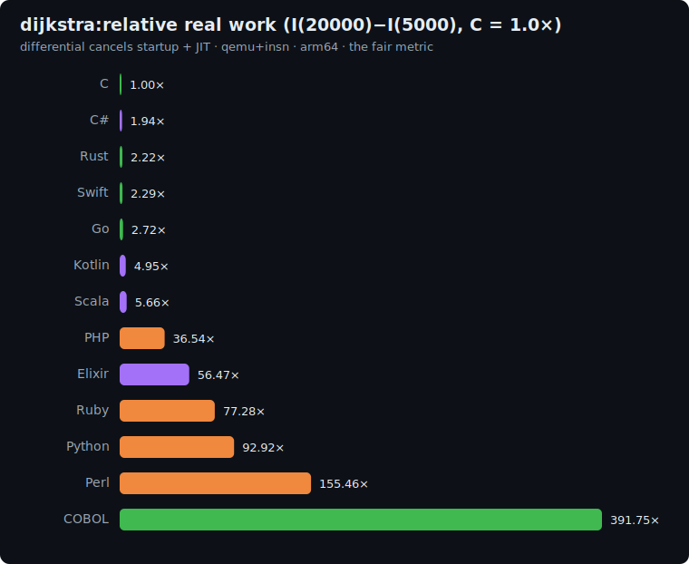

# dijkstra: study

The graph axis of the suite: **Dijkstra's single-source shortest paths** with a hand-written
**binary min-heap** priority queue. It complements [sort-search](../sort-search/README.md) (the
classic-algorithms axis) by stressing a different shape of work (a heap, an adjacency-list
traversal, and a relaxation loop over a weighted graph): the data structure at the heart of
routing, scheduling and dependency resolution.

We implement the heap ourselves (no `std::priority_queue` / `heapq` / `PriorityQueue` /
`:gb_trees`), so the benchmark measures the language running the **same** algorithm, the suite's
no-stdlib-shortcut rule.

## The algorithm

```
P = 1000000007 ; INF = 2^62 ; DEG = 8 ; MAXW = 100 ; BASE = 2^21

# 1. Generate a weighted digraph with the pinned LCG (N nodes, M = 8N directed edges)
state = 42
for e in 0..M-1:
    state = (state*1103515245 + 12345) AND 0x7fffffff ; u = state mod N
    state = (state*1103515245 + 12345) AND 0x7fffffff ; v = state mod N
    state = (state*1103515245 + 12345) AND 0x7fffffff ; w = state mod 100 + 1
    adj[u].append((v, w))            # adjacency in edge-generation (forward) order

# 2. Dijkstra from node 0 with a hand-written binary min-heap of PACKED keys
dist[*] = INF ; dist[0] = 0
heap = [ pack(0, 0) ]                 # pack(d, node) = d * BASE + node
while heap not empty:
    key = heap.pop_min()             # binary-heap extract-min (hand-written sift-down)
    d = key / BASE ; u = key mod BASE
    if d > dist[u]: continue         # stale entry (lazy deletion)
    for (v, w) in adj[u]:
        nd = d + w
        if nd < dist[v]:
            dist[v] = nd
            heap.push(pack(nd, v))   # hand-written sift-up

# 3. Checksum: polynomial hash of the distance array (unreachable -> 0)
h = 0
for i in 0..N-1:
    di = dist[i] if dist[i] < INF else 0
    h = (h * 31 + di mod P) mod P
print h                              # line 1
print "dijkstra(N)"                  # line 2
```

### Why packed keys (`dist * 2^21 + node`)

The heap orders by `(dist, node)`. Packing the pair into one integer `dist*BASE + node` makes the
heap comparison a single integer `<`, and, crucially, the packed keys are **all distinct**: a node
is only ever pushed when its distance *strictly* improves, so no two live heap entries share a
`(dist, node)`. With no ties there is no tie-breaking ambiguity, so the heap performs the **identical
sequence of operations in every language** (fair instruction counts), while Dijkstra's final
`dist[]` is unique anyway, so the checksum matches no matter how the heap is built.

**Correctness invariant:** every implementation prints the same checksum.

| N | checksum |
|---|---|
| 5000 | `562612262` |
| 20000 | `735570774` |

(`DEG = 8` keeps the graph well connected: essentially every node is reachable from node 0.)

## Fairness rules

1. **Hand-written binary min-heap** (array-based sift-up / sift-down): **no** stdlib priority queue
   / heap (`std::priority_queue`, `heapq`, `java.util.PriorityQueue`, `BinaryHeap`, `SortedSet`).
2. **Same pinned algorithm**: lazy-deletion Dijkstra, packed keys `dist*2^21+node`, adjacency in
   edge-generation order, the exact LCG and `DEG=8 / MAXW=100` parameters.
3. **Integer (floor) division** for `key / BASE` and **integer modulo** for `mod N`, `mod BASE`,
   `mod P` (Python `//`/`%`, Perl `int()`, Elixir `div`/`rem`).
4. **64-bit**: the LCG product (~2.4e10), the packed keys (`dist*2^21`, up to ~4e12) and the hash
   all need 64-bit (or arbitrary-precision) integers.
5. **All integer**, no floating point.

### Per-language representation

| Language | Heap / arrays |
|---|---|
| C | `long[]` heap + CSR adjacency |
| Rust | `Vec<i64>` heap + `Vec` adjacency |
| Go | `[]int64` heap + slice adjacency |
| Swift | `[Int]` heap + array adjacency |
| Python | `list` heap (hand-written, not `heapq`) |
| Perl | `@array` heap |
| PHP | `array` heap (not `SplPriorityQueue`) |
| Kotlin | `LongArray` heap |
| Scala | `Array[Long]` heap |
| C# | `long[]` heap |
| Elixir | `:atomics` for the heap and `dist[]` (mutable 64-bit arrays); adjacency built once |
| Ruby | `Array` heap (hand-written, not a `PriorityQueue`) + `Array`-of-`Array` adjacency |

Elixir again uses `:atomics` for the mutable heap and distance array, the honest way to run a
pointer-chasing, mutate-in-place graph algorithm on the BEAM.

## Sizes

`n1 = 5000`, `n2 = 20000` nodes (`8N` edges). Work is `O((N + M) log N)`, so the differential
`I(20000) − I(5000)` is dominated by the marginal heap + relaxation work.

## Results

Uniform qemu+insn pass, **arm64**, median of 5, differential `I(20000) − I(5000)` normalized to
**C = 1.0×**. Source: [`results/2026-06-17-arm64-dijkstra.json`](../../results/2026-06-17-arm64-dijkstra.json).
All 14 printed the identical `562612262` / `735570774` checksums: the same heap, the same relaxation
order.



| Language | I(5k) | I(20k) | differential | **vs C** (lower is better) | determinism |
|---|--:|--:|--:|--:|---|
| **C** | 5.2M | 21.7M | 16.6M | **1.00×** | exact |
| C# | 226.4M | 258.4M | 32.1M | 1.94× | jitter |
| Rust | 11.8M | 48.5M | 36.8M | 2.22× | exact |
| Swift | 22.7M | 60.7M | 38.0M | 2.29× | exact |
| Go | 14.4M | 70.8M | 56.5M | 3.41× | jitter |
| Kotlin | 269.5M | 351.5M | 82.0M | 4.95× | jitter |
| Java | 183.2M | 269.5M | 86.3M | 5.21× | jitter |
| Scala | 733.1M | 826.9M | 93.8M | 5.66× | jitter |
| JavaScript | 302.1M | 590.1M | 288.0M | 17.38× | jitter |
| PHP | 216.3M | 821.7M | 605.4M | 36.54× | exact |
| Elixir | 2.37B | 3.31B | 935.6M | 56.47× | jitter |
| Ruby | 690.0M | 1.97B | 1.28B | 77.28× | jitter |
| Python | 513.5M | 2.05B | 1.54B | 92.92× | jitter |
| Perl | 790.4M | 3.37B | 2.58B | 155.46× | jitter |

### The headline: pointer-chasing punishes access overhead

Dijkstra is **random access**: heap sift-up/down jumps around an array, and each relaxation chases
an adjacency list and probes `dist[]`. That pattern rewards lean indexing and punishes per-access
overhead. C wins (1.00×), and for once **C# (1.94×) edges out Rust (2.22×) and Swift (2.29×)**: the
CLR's JIT keeps the heap loop tight while Rust's and Swift's bounds-checked indexing on the
hot heap array adds up. The JVM trails (Kotlin 4.95×, Java 5.21×, Scala 5.66×).

**Elixir hits 56.47×, its single worst result anywhere in the suite.** Its heap *and* distance
array live in `:atomics`, so every one of the millions of heap reads/writes and `dist[]` probes is a
NIF boundary crossing. A pointer-chasing, mutate-in-place graph algorithm is the precise opposite of
what the BEAM is good at, and exactly where binary-trees (0.30×) showed it at its best. No runtime
in the suite swings harder by workload.

### The seven-axis picture: the whole project in one table

Differential vs C = 1.0× across the complete suite:

| Language | fannkuch | binary-trees | mandelbrot | k-nucleotide | reverse-comp | sort-search | dijkstra |
|---|--:|--:|--:|--:|--:|--:|--:|
| **Rust** | 1.14× | 1.19× | 1.17× | 2.73× | 0.99× | 1.34× | 2.22× |
| Go | 1.49× | 1.09× | 1.29× | 4.93× | 1.59× | 1.41× | 2.72× |
| C# | 1.61× | 0.45× | 1.19× | 9.73× | 1.71× | 1.46× | 1.94× |
| Swift | 3.42× | 1.72× | 1.17× | 9.67× | 1.48× | 1.89× | 2.29× |
| Scala | 2.73× | 0.28× | 0.97× | 10.53× | 4.78× | 3.10× | 5.66× |
| Kotlin | 3.34× | 0.28× | 1.28× | 9.98× | 4.39× | 3.55× | 4.95× |
| Java | 3.62× | 0.33× | 2.99× | 17.50× | 6.13× | 4.32× | 5.21× |
| JavaScript | 4.69× | 0.57× | 2.45× | 18.63× | 8.30× | 4.51× | 17.38× |
| Elixir | 29.71× | 0.30× | 18.76× | 39.64× | 9.42× | 36.47× | 56.47× |
| PHP | 33.62× | 5.75× | 34.10× | 16.02× | 39.44× | 39.28× | 36.54× |
| Ruby | 104.64× | 10.34× | 117.20× | 56.39× | 57.08× | 79.91× | 77.28× |
| Python | 69.57× | 11.15× | 124.76× | 49.80× | 114.00× | 131.93× | 92.92× |
| Perl | 189.62× | 18.98× | 216.87× | 36.40× | 181.17× | 189.53× | 155.46× |

The conclusion the whole suite was built to support:

- **No language is "fast" or "slow," only fast or slow at a kind of work.** The same fourteen
  languages reorder across these seven columns; the spread *within a single row* reaches **100×**
  (Elixir: 0.30× → 56.47×).
- **Rust** is the lone all-rounder: never below 0.99×, never above 2.73×. If you want one language
  that is never the wrong choice, the data points here.
- **C#** quietly turns in the most balanced managed profile (0.45×–9.73×), strong on every axis but
  the std hash map.
- **The JVM** is a brilliant specialist: peerless at allocation, mid-pack everywhere else.
- **Elixir** is the sharpest knife and the bluntest: pick it for functional, allocation-heavy,
  concurrent work; never for in-place array or graph crunching.
- **The interpreters** are a constant 1–2 orders of magnitude back, each least-bad on whichever axis
  its native-C internals (the hash map, the regex/array engine) do the heavy lifting.

Seven benchmarks, seven orderings. **There is no scalar "speed of a language."**

## Reproduce

```bash
BENCH=dijkstra scripts/bench-local.sh <lang>
```
