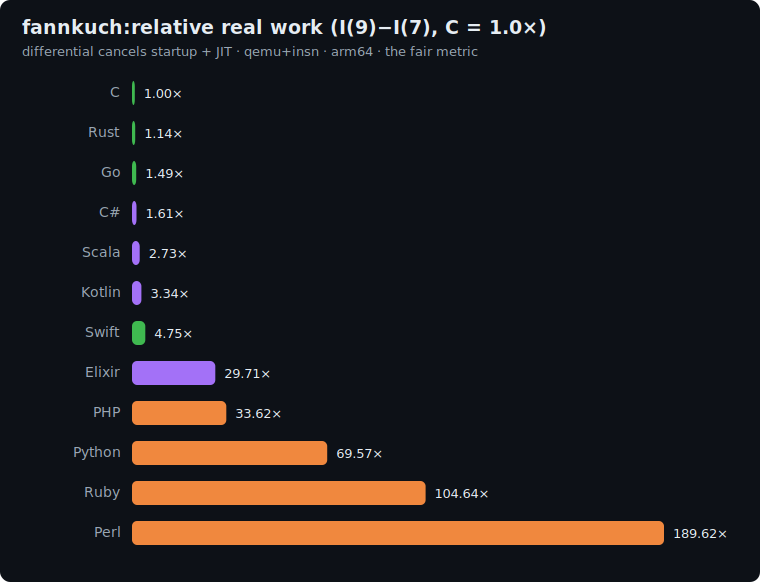
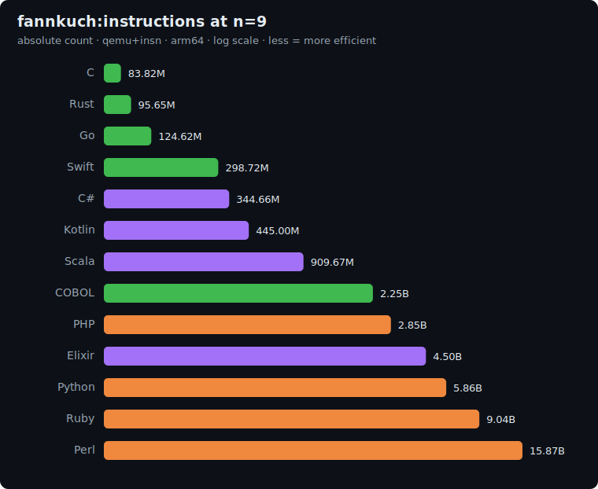
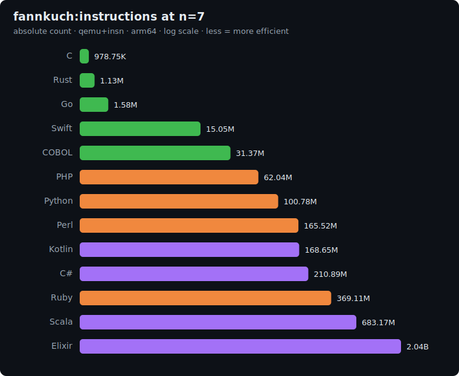

# fannkuch-redux: study

Permutation benchmark from the
[Computer Language Benchmarks Game](https://benchmarksgame-team.pages.debian.net/benchmarksgame/description/fannkuchredux.html).
Pure CPU, integer-only, no I/O and no allocation in the hot loop.

## The algorithm

Generate every permutation of `[0..n)`, repeatedly reverse the prefix indicated by the first
element, and report `Pfannkuchen(n)` (the maximum number of reversals) and a parity-weighted
`checksum`.

**Correctness invariant:** every implementation must print the same `checksum` and
`Pfannkuchen(n)`. That's the proof they all do the same work.

| n | checksum | Pfannkuchen(n) |
|---|---|---|
| 7 | `228` | `16` |
| 9 | `8629` | `30` |

**Correctness: 13/13 ✅.** The 12 language implementations + C (baseline) reproduce the checksums.

---

## The measurement challenge (the real study)

Counting instructions **uniformly and comparably** across all runtimes was the central problem,
and it took an instructive turn.

### The backend: QEMU user-mode + the TCG `insn` plugin

It emulates at the instruction level and counts the *guest's* instructions. Deterministic and,
within one ISA, **directly comparable**. (valgrind/cachegrind was rejected: it segfaults on Go
and measures the wrong process for launcher runtimes.)

### The false wall (and the lesson)

For a while it looked like qemu **couldn't emulate** the complex runtimes (CPython, Perl, PHP,
JVM, BEAM): all exited with `exit 1` and no output. After a lot of debugging (even building
qemu 10 from source), it turned out to be a **harness bug, not emulation**:

> **`qemu-user` does not resolve a bare command name via `PATH`.** Natives are invoked with an
> absolute path (`/app/fannkuch`) → they worked; interpreters/VMs with a bare command
> (`python …`, `java …`) → qemu couldn't find them and failed silently. **Fix:** resolve
> `argv[0]` to an absolute path before handing it to qemu (`scripts/measure.sh`).

With that, **qemu 7.2 emulates all 13 fine.** Lesson: *"produces no output" ≠ "can't emulate"*.
Verify the cause before concluding.

Four real infrastructure problems were solved along the way, documented in
`languages/_base/Dockerfile.qemu-insn`: glibc mismatch across heterogeneous images (→ bundle the
`.so` closure), guest contamination via `LD_LIBRARY_PATH` (→ patchelf RPATH `$ORIGIN`), .NET's
multi-process muxer (→ self-contained single-file publish), and qemu-with-plugins vs emulation.

### Elixir: the nested launcher

`elixir` → `erl` → `beam.smp` are all shell wrappers; qemu can't run a shell script, and on the
same architecture it execs the children natively (uninstrumented). **Fix:** capture the exact
`beam.smp` ELF invocation (argv prefix + the `BINDIR`/`ROOTDIR`/`EMU`/`PROGNAME` env the wrappers
set) at build time and run `beam.smp` directly under qemu as a single instrumented process. See
`languages/elixir/capture-beam.sh`.

---

## Results: uniform qemu+insn pass

Single backend (`qemu-insn`, qemu 7.2), same ISA (arm64 local), **all 13 directly comparable**.
Raw data in [`results/2026-06-16-arm64-fannkuch.json`](../../results/2026-06-16-arm64-fannkuch.json).

### The fair metric: real work `I(9) − I(7)`, normalized to C = 1.0×

The absolute count includes the runtime's startup cost, which varies wildly (C ~1M, C# ~211M,
Elixir/BEAM ~2B). The differential between two sizes cancels it (and JIT compilation too),
isolating the algorithm's real work. C (gcc `-O2`, no GC) is the reference floor.



| Language | Archetype | Real work (C = 1.0×) | Determinism |
|---|---|---:|---|
| **C** | native | 1.00× | exact |
| **Rust** | native | 1.14× | exact |
| **Go** | compiled + GC | 1.49× | jitter |
| **C#** | CLR (self-contained) | 1.61× | jitter |
| **Scala** | JVM | 2.73× | jitter |
| **Kotlin** | JVM | 3.34× | jitter |
| **Swift** | native | 4.75× | exact |
| **COBOL** | native | 26.78× | exact |
| **Elixir** | BEAM | 29.71× | jitter |
| **PHP** | interpreter | 33.62× | exact |
| **Python** | interpreter | 69.57× | jitter |
| **Ruby** | interpreter | 104.64× | jitter |
| **Perl** | interpreter | 189.62× | jitter |

> Regenerated from `results/2026-06-16-arm64-fannkuch.json`. Ordering: native/AOT (C, Rust, Go, C# ≈
> 1–1.6×) < JVM (Scala/Kotlin ≈ 2.5–2.8×) < Swift (COW/ARC) < **COBOL** (26.78×, native-compiled yet
> lands in the managed tier - even *beating* Elixir's 29.71×) < managed/interpreted (Elixir, PHP,
> Python, Perl, tens to hundreds ×).

**Readings:**
- **C and Rust are the efficiency floor** (Rust only a few % above C: bounds checks).
- **The JVM with JIT is excellent** once startup is removed by the differential.
- **Swift costs more than its native peers**: copy-on-write array + ARC. A fairness case to
  review (language vs implementation), for the `algo-expert`.
- **COBOL is "compiled ≠ fast"**: GnuCOBOL transpiles to native ELF (and is bit-**exact**, unlike
  the interpreters) yet emits heavy `libcob` calls per statement, so on this plain integer loop it
  costs 26.78× - slower than every JVM/native peer and even past Elixir's BEAM.
- **Interpreters** confirm their cost (Perl the priciest).
- **Determinism:** pure natives (C, Rust, Swift) and the PHP interpreter are bit-exact across
  runs. Concurrent/JIT runtimes (Go, C#, Kotlin, Scala, Python, Elixir) jitter even with the
  `runtimeEnv` single-thread/GC-off constraints. The spread is small for Go (~0.01 %) but
  reaches **single-digit percent for the JVM** (Kotlin's i_n2 spans ~12 % over 3 runs), so the
  table reports the **median of N** and the raw runs + min/max are kept in the results JSON.
  Treat the JVM ratios as approximate, not point estimates.

### Absolute counts




---

## Scope and follow-up

- **Fairness review** of the Swift case (COW/ARC) by the `algo-expert`.
- **Canonical x86_64 pass in CI** (runners are amd64; the base picks `qemu-x86_64`).
- **Larger n** for sharper ratios once a dedicated runner makes the slow interpreters/BEAM cheap.

## Reproduce

```bash
scripts/bench-local.sh <lang>                                   # measure one language
python3 scripts/make_charts.py results/2026-06-16-arm64-fannkuch.json # regenerate charts
```
