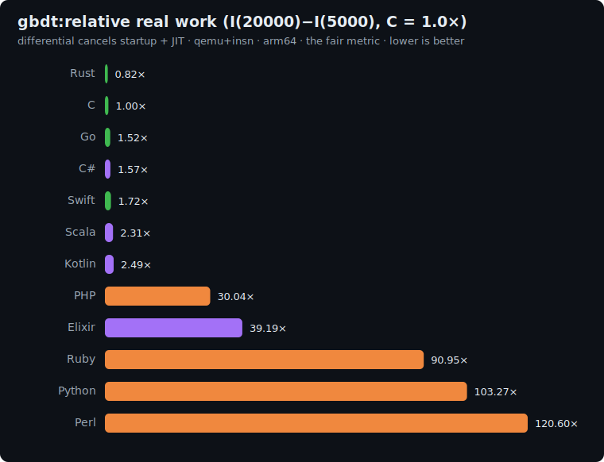

# gbdt: study

The ML-inference axis of the suite: **gradient-boosted decision-tree ensemble inference**
(the dominant tabular-ML algorithm, as used by XGBoost/LightGBM/CatBoost). This is a
different shape of work from k-means or sha256: the hot path is **data-dependent,
arithmetic-free control-flow traversal** of a static tree, accumulated over an ensemble of
B=200 trees per sample. Each tree is a complete binary tree of depth D=8, traversed once
per (sample, tree) pair via D compare-and-branch steps. With N samples and B trees, the
inference loop performs N·B·D = N·1600 traversals.

The key new axis this exposes: the cost of **branchy data-dependent index arithmetic** — the
compare/select/double-plus-one per descent — vs both the fixed-opcode dispatch of `vm` (same
instruction every step) and the heap-driven branching of `dijkstra` (unpredictable priority
ordering). Under the qemu+insn metric this measures the branch+index *instruction mix* of the
traversal (hardware branch-misprediction cost is not counted, but the per-node
compare+index work is fully captured).

## The algorithm

```
P = 1000000007 ; D = 8 ; B = 200 ; F = 8
NODES = 2^(D+1) - 1 = 511   # flat complete binary tree
LEAF_START = 2^D - 1 = 255  # internal nodes 0..254; leaves 255..510
# children of node k: left = 2k+1, right = 2k+2

# 1. Build ensemble via pinned LCG (seed=42, glibc-style)
state = 42
for b in 0..B-1:
    for node in 0..LEAF_START-1:           # internal nodes: feat THEN thr per node
        state = LCG(); feat[b*NODES+node] = state % F
        state = LCG(); thr[b*NODES+node]  = state % 256
    for node in LEAF_START..NODES-1:       # leaves
        state = LCG(); leafval[b*NODES+node] = state % 10

# 2. Draw N samples, F features each (continuing same LCG state)
for i in 0..N-1:
    for f in 0..F-1:
        state = LCG(); sample[i*F + f] = state % 256

# 3. Inference (the hot path)
h = 0 ; total = 0
for i in 0..N-1:
    acc = 0
    for b in 0..B-1:
        node = 0
        repeat D times:                    # exactly 8 descents → leaf 255..510
            if sample[i*F + feat[b*NODES+node]] <= thr[b*NODES+node]:
                node = 2*node + 1          # left
            else:
                node = 2*node + 2          # right
        acc = acc + leafval[b*NODES+node]
    h = (h*31 + acc + 1) % P
    total = (total + acc) % P

print h                                    # line 1: primary checksum
print "gbdt(N) = <total>"                  # line 2: secondary
```

`acc` max is B·9 = 1800; `h` and `total` use 64-bit for the `h*31` intermediate.
The comparison is `<=` (pinned). The tree layout is the flat complete-binary-tree convention
(children `2k+1`/`2k+2`); every implementation visits the identical node sequence per
(sample, tree). No floating point anywhere.

**Correctness invariant:** every implementation prints the same checksum.

| N | primary (h) | secondary (total) |
|---|---|---|
| 5000 | `942269883` | `4431035` |
| 20000 | `331087620` | `17723750` |

## Fairness rules

1. **No tree/ML inference library** (`sklearn`, `xgboost`, `lightgbm`, `catboost`, anything)
   — the explicit complete-binary-tree array traversal above in every language. Same
   "no shortcut" spirit as the other benchmarks.
2. **Flat complete-binary-tree layout**: internal nodes 0..254, leaves 255..510; children
   of `k` are `2k+1` (left) and `2k+2` (right). Every implementation visits the identical
   node sequence per (sample, tree).
3. **Pinned LCG draw order**: feat then thr per internal node (in node order 0..254), then
   leafval per leaf (255..510), repeated for each tree b=0..B-1; samples drawn after all
   trees. Any reordering changes the checksums.
4. **Pinned comparison `<=`**; tree descent is fully determined by integers.
5. **All integer**: inputs/thresholds are `int`; `acc` max 1800; `h`/`total` need 64-bit for
   `h*31` ≈ 2.9e10.

### Per-language array representation

| Language | feat/thr/leafval | sample | h/total |
|---|---|---|---|
| C | `int[]` | `int[]` | `long` |
| Rust | `Vec<i32>` | `Vec<i32>` | `i64` |
| Go | `[]int32` | `[]int32` | `int64` |
| Swift | `[Int32]` | `[Int32]` | `Int` |
| Python | `list` | `list` | `int` |
| Perl | `@array` | `@array` | integer |
| PHP | `array` | `array` | `int` |
| Kotlin | `IntArray` | `IntArray` | `Long` |
| Scala | `Array[Int]` | `Array[Int]` | `Long` |
| C# | `int[]` | `int[]` | `long` |
| Elixir | `:atomics` (feat/thr/leafval/sample) | `:atomics` | bignum (mod P) |
| Ruby | `Array` | `Array` | `Integer` |
| COBOL | `PIC S9(9) COMP-5 OCCURS` (feat/thr/leafval/sample) | — | `PIC S9(18) COMP-5` (h/total) |

## Sizes

`n1 = 5000`, `n2 = 20000` samples. Work is `N·B·D` (N·1600 tree traversals); the
differential `I(20000) − I(5000)` isolates the marginal per-sample inference cost.

## Results: uniform qemu+insn pass

Single backend (`qemu-insn`), same ISA (arm64 local). Raw data in
[`results/2026-06-21-arm64-gbdt.json`](../../results/2026-06-21-arm64-gbdt.json).

### The fair metric: real work `I(20000) - I(5000)`, normalized to C = 1.0x (lower is better)

The absolute count includes the runtime's startup, which varies wildly across runtimes. The
differential between the two sizes cancels it (and JIT compilation), isolating the algorithm's real
work. C (gcc `-O2`, no GC) is the reference floor; below 1.0x beats C.



| Language | I(5k) | I(20k) | differential | **vs C** (lower is better) | determinism |
|---|--:|--:|--:|--:|---|
| Rust | 93.4M | 370.3M | 276.9M | **0.82×** | exact |
| **C** | 113.5M | 450.5M | 337.1M | **1.00×** | exact |
| Go | 173.0M | 685.0M | 512.0M | 1.52× | jitter |
| C# | 394.0M | 922.4M | 528.4M | 1.57× | jitter |
| Swift | 206.5M | 786.9M | 580.4M | 1.72× | exact |
| Scala | 983.0M | 1.76B | 777.5M | 2.31× | jitter |
| Kotlin | 495.3M | 1.34B | 840.3M | 2.49× | jitter |
| PHP | 3.45B | 13.6B | 10.1B | 30.04× | exact |
| Elixir | 6.57B | 19.8B | 13.2B | 39.19× | jitter |
| Ruby | 10.6B | 41.3B | 30.7B | 90.95× | jitter |
| Python | 12.0B | 46.8B | 34.8B | 103.27× | jitter |
| Perl | 13.8B | 54.5B | 40.6B | 120.60× | jitter |
| COBOL | 17.9B | 69.0B | 51.1B | 151.47×\* | exact (extrap.) |

## Reproduce

```bash
BENCH=gbdt scripts/bench-local.sh <lang>
```
