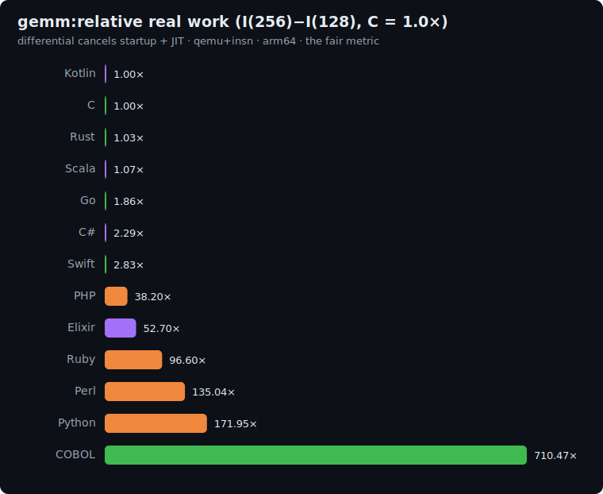

# gemm: study

The ML-inference axis of the suite: **quantized integer matrix-multiply**, the dominant
kernel in every modern neural-network runtime. A square N×N matmul (O(N³) work) with
integer inputs in 0..127, 64-bit accumulators, and a pinned loop order — the same shape
as INT8 GEMM in `llama.cpp`, TensorRT, and similar engines.

Integer (not float) removes all FMA / summation-order divergence, so all twelve
implementations land on the bit-identical result.

## The algorithm

```
P = 1000000007

# 1. Generate A then B, each N*N elements in 0..127, via the pinned LCG (glibc-style).
state = 42
for idx in 0..N*N-1:
    state = (state*1103515245 + 12345) & 0x7fffffff
    A[idx] = state % 128
for idx in 0..N*N-1:
    state = (state*1103515245 + 12345) & 0x7fffffff
    B[idx] = state % 128

# 2. Compute C = A * B with PINNED loop order i, k, j (fairness rule).
C[0..N*N-1] = 0
for i in 0..N-1:
    for k in 0..N-1:
        a = A[i*N + k]
        for j in 0..N-1:
            C[i*N+j] += a * B[k*N+j]

# 3. Checksum (poly-hash, row-major).
h = 0
for idx in 0..N*N-1:
    h = (h*31 + C[idx] % P) % P
print h                   # line 1: the checksum (sum)
print "gemm(N)"           # line 2
```

Secondary checksum = `C[N*N-1] % P` (the bottom-right cell).

**Correctness invariant:** every implementation prints the same checksum.

| N   | checksum    | secondary |
|-----|-------------|-----------|
| 128 | `151580209` | `341376`  |
| 256 | `586643040` | `682752`  |

## Fairness rules

1. **No BLAS / no `numpy.dot` / no `@` operator / no `breeze`/`nd4j`/`torch`/`Mat`
   libs.** The explicit triple loop above in every language (same spirit as k-means'
   "no scikit-learn"). The whole point of the benchmark is the loop cost, not a
   library call.
2. **Loop order is i, k, j — pinned.** This is the "row-friendly B" order: the inner
   j-loop reads B row-sequentially, which maximises cache reuse for B. Every language
   must preserve this order; i,j,k (the naive order) is not permitted.
3. **All integer, unsigned 0..127 inputs, 64-bit accumulators.** No float anywhere.
   Cell max = N·127·127: at N=256 that is ~4.13M, well within int32, but 64-bit
   accumulators are used everywhere to be safe and consistent.
4. **LCG seed = 42**, same glibc formula as sort-search and k-means.

### Per-language array representation

| Language | A / B        | C            |
|----------|--------------|--------------|
| C        | `long[]`     | `long[]`     |
| Rust     | `Vec<i64>`   | `Vec<i64>`   |
| Go       | `[]int64`    | `[]int64`    |
| Swift    | `[Int]`      | `[Int]`      |
| Python   | `list`       | `list`       |
| Perl     | `@array`     | `@array`     |
| PHP      | `array`      | `array`      |
| Kotlin   | `LongArray`  | `LongArray`  |
| Scala    | `Array[Long]`| `Array[Long]`|
| C#       | `long[]`     | `long[]`     |
| Elixir   | `:atomics`   | `:atomics`   |
| Ruby     | `Array`      | `Array`      |

## Sizes

`n1 = 128`, `n2 = 256`. Work is O(N³): the differential
`I(256) − I(128)` is dominated by the 8× more multiply-add operations
(and the ~4× larger working set in the L2/L3 cache).

## Results: uniform qemu+insn pass

Single backend (`qemu-insn`), same ISA (arm64 local). Raw data in
[`results/2026-06-21-arm64-gemm.json`](../../results/2026-06-21-arm64-gemm.json).

### The fair metric: real work `I(256) - I(128)`, normalized to C = 1.0x (lower is better)

The absolute count includes the runtime's startup, which varies wildly across runtimes. The
differential between the two sizes cancels it (and JIT compilation), isolating the algorithm's real
work. C (gcc `-O2`, no GC) is the reference floor; below 1.0x beats C.



| Language | I(128) | I(256) | differential | **vs C** (lower is better) | determinism |
|---|--:|--:|--:|--:|---|
| Kotlin | 241.7M | 345.8M | 104.0M | **1.00×** | jitter |
| **C** | 15.3M | 119.8M | 104.4M | **1.00×** | exact |
| Rust | 16.3M | 123.6M | 107.2M | 1.03× | exact |
| Scala | 712.2M | 823.5M | 111.2M | 1.07× | jitter |
| Go | 28.6M | 222.4M | 193.9M | 1.86× | jitter |
| C# | 247.4M | 486.6M | 239.2M | 2.29× | jitter |
| Swift | 54.0M | 349.9M | 295.9M | 2.83× | exact |
| PHP | 615.0M | 4.60B | 3.99B | 38.20× | exact |
| Elixir | 2.82B | 8.32B | 5.50B | 52.70× | jitter |
| Ruby | 1.75B | 11.8B | 10.1B | 96.60× | jitter |
| Perl | 2.09B | 16.2B | 14.1B | 135.04× | jitter |
| Python | 2.67B | 20.6B | 18.0B | 171.95× | jitter |

## Reproduce

```bash
BENCH=gemm scripts/bench-local.sh <lang>
```
