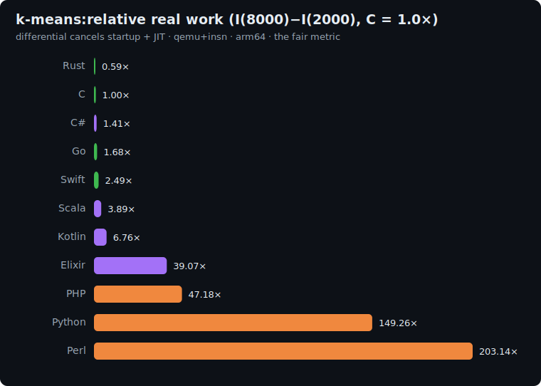

# k-means: study

The machine-learning axis of the suite: **Lloyd's k-means clustering**, the canonical unsupervised
ML algorithm. It is a different shape of work from the other eight: an *iterative* refine loop
whose hot path is **nearest-centroid search** (a distance computation against every cluster, for
every point, every iteration) followed by a **reduction** (recomputing each centroid as the mean of
its members).

Most ML is floating-point, but float would wreck cross-language reproducibility (FMA contraction and
non-associative summation give different bits in different languages). So this is **integer k-means**,
which is also exactly how quantized models run in production. Integer arithmetic is exact and
associative, so all thirteen implementations land on the bit-identical result.

## The algorithm

```
P = 1000000007 ; K = 16 clusters ; D = 4 dims ; ITERS = 10 ; RANGE = 256

# 1. Generate N integer D-dimensional points with the pinned LCG
state = 42
for i in 0 .. N*D-1:
    state = (state*1103515245 + 12345) AND 0x7fffffff
    pt[i] = state mod 256
centroid[0..K*D-1] = pt[0..K*D-1]                  # initial centroids = the first K points

# 2. ITERS iterations of assign + update
repeat ITERS times:
    for each point i:                              # assignment: nearest centroid
        best = 0 ; bestDist = -1
        for k in 0..K-1:
            dist = sum over d of (pt[i*D+d] - centroid[k*D+d])^2     # integer squared distance
            if bestDist < 0 OR dist < bestDist:    # STRICT < : ties go to the lowest k
                bestDist = dist ; best = k
        assign[i] = best
    sum[0..K*D-1] = 0 ; count[0..K-1] = 0          # update: floor-mean
    for each point i:
        count[assign[i]] += 1
        for d in 0..D-1: sum[assign[i]*D+d] += pt[i*D+d]
    for k in 0..K-1:
        if count[k] > 0:
            for d in 0..D-1: centroid[k*D+d] = sum[k*D+d] / count[k]   # INTEGER (floor) division
        # else: leave centroid[k] unchanged (empty cluster)

# 3. One final assignment with the final centroids, then a checksum
for each point i: assign[i] = argmin_k dist^2(pt[i], centroid[k])     # lowest k on tie
h = 0
for v in centroid[0..K*D-1]: h = (h*31 + v) mod P
for i in 0..N-1:             h = (h*31 + assign[i]) mod P
print h                                            # line 1
print "k-means(N)"                                 # line 2
```

The checksum folds in both the **final centroids** and **every point's assignment**, so it is only
correct if the whole iterative computation (distances, tie-breaks, floor-means, empty-cluster
handling) matches exactly.

**Correctness invariant:** every implementation prints the same checksum.

| N | checksum |
|---|---|
| 2000 | `70735446` |
| 8000 | `52003413` |

## Fairness rules

1. **Hand-written Lloyd's algorithm**: the explicit assign/update loops above. **No** ML/numeric
   library (`numpy`, `scikit-learn`, BLAS, `Math.Net`, `nd4j`, `Nx`), no k-d-tree/ball-tree
   nearest-neighbour acceleration. The same `O(N·K·D)` brute-force assignment in every language.
2. **Integer arithmetic** throughout: squared distance is integer; the centroid mean is integer
   (**floor**) division (`//` Python, `int()` Perl, `intdiv` PHP, `div` Elixir). No floating point.
3. **Pinned determinism**: `K=16, D=4, ITERS=10, RANGE=256`; initial centroids = the first K points;
   ties in the assignment go to the **lowest-index** centroid (strict `<`); an **empty cluster keeps
   its centroid unchanged**; the exact LCG point generation.
4. **64-bit** for the per-cluster sums and the hash (`h*31` ≈ 3.1e10).

### Per-language array representation

| Language | Arrays (points / centroids / assignment) |
|---|---|
| C | `long[]` / `long[]` / `int[]` |
| Rust | `Vec<i64>` |
| Go | `[]int64` |
| Swift | `[Int]` |
| Python | `list` |
| Perl | `@array` |
| PHP | `array` |
| Kotlin | `LongArray` / `IntArray` |
| Scala | `Array[Long]` / `Array[Int]` |
| C# | `long[]` / `int[]` |
| Elixir | `:atomics` (points, centroids, assignment, the per-iteration sums/counts) |
| Ruby | `Array` (`Array.new(n*D, 0)`; centroids via the slice `pt[0, K*D]`) |
| COBOL | `PIC S9(18) COMP-5 OCCURS` tables (points / centroids / sums) + `S9(9) COMP-5 OCCURS` assignment |

## Sizes

`n1 = 2000`, `n2 = 8000` points. Work is `ITERS · N · K · D` (the assignment dominates), so the
differential `I(8000) − I(2000)` is dominated by the marginal nearest-centroid search.

## Results

Uniform qemu+insn pass, **arm64**, median of 5, differential `I(8000) − I(2000)` normalized to
**C = 1.0×**. Source: [`results/2026-06-17-arm64-k-means.json`](../../results/2026-06-17-arm64-k-means.json).
All 13 printed the identical `70735446` / `52003413` checksums: same clusters, same assignments.



| Language | I(2k) | I(8k) | differential | **vs C** | determinism |
|---|--:|--:|--:|--:|---|
| Rust | 8.9M | 35.0M | 26.1M | **0.59×** | exact |
| **C** | 14.8M | 58.9M | 44.1M | **1.00×** | exact |
| C# | 240.1M | 302.1M | 62.0M | 1.41× | jitter |
| Go | 24.9M | 98.9M | 74.0M | 1.68× | jitter |
| Swift | 48.0M | 158.0M | 110.0M | 2.49× | exact |
| Scala | 771.8M | 943.2M | 171.4M | 3.89× | jitter |
| Kotlin | 282.6M | 580.6M | 298.0M | 6.76× | jitter |
| Elixir | 2.7B | 4.4B | 1.7B | 39.07× | jitter |
| PHP | 728.9M | 2.8B | 2.1B | 47.18× | jitter |
| Ruby | 1.6B | 5.6B | 4.0B | 91.12× | jitter |
| Python | 2.2B | 8.8B | 6.6B | 149.26× | jitter |
| Perl | 3.0B | 12.0B | 9.0B | 203.14× | jitter |
| COBOL | 5.9B | 23.5B | 17.6B | 398.73× | exact |

### The headline: Rust beats C again, on the same lever

The hot path is the nearest-centroid search: for every point, an integer **squared-distance reduction**
against all K centroids. Like blur, that is an auto-vectorizable loop, and **Rust's LLVM backend
exploits it: 0.59×, beating C** (built with `gcc -O2`, scalar). Rust now wins outright on exactly the
two axes whose inner loops vectorize cleanly (blur 0.48×, k-means 0.59×). Behind it C leads, then C#
(1.41×), Go (1.68×) and Swift (2.49×); the JVM lands at 3.9–6.8× (no auto-vectorisation + bounds
checks), Elixir at 39× (its five working arrays all live in NIF-crossed `:atomics`), and the
interpreters detonate as ever, Perl at 203×. And below even Perl sits **COBOL at 398.73×** -
native-compiled to ELF, yet the slowest language here: GnuCOBOL emits a libcob call per statement,
so its arithmetic-heavy assign/update inner loops never get near the metal.

### The nine-axis picture: the full suite

Differential vs C = 1.0× across all nine benchmarks (int / alloc / float / hash / string / algorithms
/ graph / image / ML):

| Lang | fann | b-trees | mandel | k-nuc | rev-c | sort | dijk | blur | kmeans |
|---|--:|--:|--:|--:|--:|--:|--:|--:|--:|
| **Rust** | 1.14 | 1.19 | 1.17 | 2.73 | 0.99 | 1.34 | 2.22 | **0.48** | **0.59** |
| Go | 1.49 | 1.09 | 1.29 | 4.93 | 1.59 | 1.41 | 2.72 | 1.23 | 1.68 |
| C# | 1.61 | 0.45 | 1.19 | 9.73 | 1.71 | 1.46 | 1.94 | 1.01 | 1.41 |
| Swift | 4.75 | 1.72 | 1.17 | 9.67 | 1.48 | 1.89 | 2.29 | 0.56 | 2.49 |
| Scala | 2.73 | 0.28 | 0.97 | 10.53 | 4.78 | 3.10 | 5.66 | 3.32 | 3.89 |
| Kotlin | 3.34 | 0.28 | 1.28 | 9.98 | 4.39 | 3.55 | 4.95 | 3.28 | 6.76 |
| Elixir | 29.71 | 0.30 | 18.76 | 39.64 | 9.42 | 36.47 | 56.47 | 15.49 | 39.07 |
| PHP | 33.62 | 5.75 | 34.10 | 16.02 | 39.44 | 39.28 | 36.54 | 43.03 | 47.18 |
| Ruby | 104.64 | 10.34 | 117.20 | 1437.92 | 57.08 | 79.91 | 77.28 | 115.20 | 91.12 |
| Python | 69.57 | 11.15 | 124.76 | 49.80 | 114.00 | 131.93 | 92.92 | 120.91 | 149.26 |
| Perl | 189.62 | 18.98 | 216.87 | 36.40 | 181.17 | 189.53 | 155.46 | 264.40 | 203.14 |
| COBOL | 26.78 | 182.75 | 7908.42 | 7686.05 | 221.82 | 330.02 | 391.75 | 152.72 | 398.73 |

Nine benchmarks, nine orderings of the same thirteen languages, the thesis now overdetermined:

- **C is the baseline, not the ceiling.** It wins seven of nine, but loses both vectorizable axes
  (blur, k-means) to LLVM-backed Rust. A `gcc -O3` C build would narrow that, but the suite pins
  idiomatic `-O2`.
- **Rust** spans 0.48×–2.73× and is the only language to beat C on three axes: the dependable pick.
- **C#** is the steadiest managed runtime (0.45×–9.73×); **the JVM** a allocation specialist; **Elixir**
  owns the widest range of any language (0.30×–56.47×); **the interpreters** sit a steady 1–2 orders
  back, each least-bad where its native-C internals carry the load.
- **COBOL** is the suite's "compiled ≠ fast" proof: GnuCOBOL transpiles to native ELF and is
  bit-**exact** (unlike the interpreters), yet it is the slowest language on almost every axis because
  libcob runs a function call per statement. On plain integer loops it is "only" 27–730× (and even
  **beats Elixir on fannkuch**, 26.78× vs 29.71×), but it has three cliffs where it lacks a native
  primitive: **sha256 222956×** (the single most extreme cell in the entire suite, ~155× past the prior
  record - bit ops hand-emulated, value extrapolated), **mandelbrot 7908×** (COMP-2 doubles routed
  through GMP arbitrary-precision DECIMAL, no FPU codegen), and **k-nucleotide 7686×** (string-keyed
  hashing). Here on k-means it lands at 398.73×, last of all thirteen.
- **The same language's row varies by up to ~190×** (Elixir 0.30×→56.47×). A scalar "language speed"
  would have to average that away, which is exactly why it is meaningless.

**There is no single speed of a language, only its speed at a kind of work. Nine axes prove it.**

## Reproduce

```bash
BENCH=k-means scripts/bench-local.sh <lang>
```
