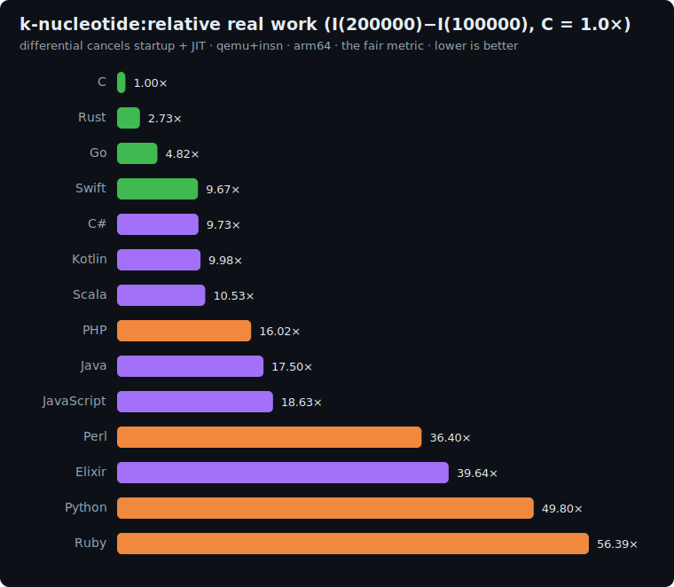

# k-nucleotide: study

Associative-container benchmark, adapted from the
[Computer Language Benchmarks Game](https://benchmarksgame-team.pages.debian.net/benchmarksgame/description/knucleotide.html).
It is the fourth axis of the suite, distinct from [fannkuch](../fannkuch/README.md) (integer
compute), [binary-trees](../binary-trees/README.md) (allocation/GC), and
[mandelbrot](../mandelbrot/README.md) (floating-point): **k-nucleotide measures the standard
hash map / dictionary** (string hashing, insert, lookup-and-update, and iteration), the data
structure most real backend code leans on hardest.

## The algorithm

Generate a DNA sequence of length `L`, then count how often every length-`K` substring
(**k-mer**, `K = 8`) occurs, using a hash map keyed by the k-mer string. Reduce the map to one
checksum.

```
# 1. Deterministic DNA via an integer linear congruential generator (NO floating point)
seed = 42
for i in 0..L-1:
    seed = (seed * 3877 + 29573) mod 139968
    S[i] = 'A' if seed < 42000     # ~30%
           'C' if seed < 70000     # ~20%
           'G' if seed < 98000     # ~20%
           'T' otherwise           # ~30%

# 2. Count every K-mer in a hash map keyed by the K-character substring
map = {}
for i in 0 .. L-K:
    map[ S[i .. i+K-1] ] += 1      # insert-or-increment

# 3. Order-independent checksum over the map
acc = 0
for (kmer, count) in map:          # any iteration order
    e = 0
    for ch in kmer:                # decode big-endian: A=0,C=1,G=2,T=3
        e = e*4 + code(ch)
    acc = (acc + e * count) mod 1000000007
print acc                          # line 1
print "k-nucleotide(L)"            # line 2
```

The checksum is `Σ encode(kmer)·count mod 1e9+7`. Because it is a **sum**, it is independent of
the map's hash function and iteration order, yet sensitive to both *which* k-mers occur and
*how often*, so every language must build the exact same multiset of counts to match it.

**Correctness invariant:** every implementation must print the same checksum.

| L | checksum |
|---|---|
| 100000 | `267275319` |
| 200000 | `552155843` |

The integer LCG has period 139968, so the set of distinct 8-mers saturates (~53,106) once
`L > 139968`; beyond that the work is dominated by **lookup-and-update on existing keys**,
which is exactly the hash-map hot path the differential isolates.

## Fairness rules

The benchmark measures the **hash map**, so the rules protect that:

1. **Use the language's idiomatic built-in hash map / dictionary**, keyed by the **k-mer
   string** (the K-character substring), value = count. C has no standard map, so it hand-rolls
   an open-addressing table with a general string hash (FNV-1a) + linear probing, documented
   below. This "built-in map vs hand-rolled C" contrast is the honest comparison.
2. **No direct-addressing shortcut.** The key space for `K = 8` is only `4^8 = 65536`, so one
   *could* index a flat array by a 2-bit-per-base encoding and skip hashing entirely. That is a
   disqualifying cheat. It stops being a hash-map benchmark. The key must be the **string**,
   hashed by the map.
3. **No analytic shortcut**: actually build the sequence and count every k-mer.
4. **Identical generator + parameters**: the integer LCG `(seed*3877+29573) mod 139968` from
   `seed = 42`, the `42000 / 70000 / 98000` nucleotide thresholds, `K = 8`, and the checksum
   `Σ encode(kmer)·count mod 1e9+7` with the big-endian `A=0,C=1,G=2,T=3` decode.
5. **All integer arithmetic**: no floating point anywhere (the generator and checksum are
   integer by construction, so there is no cross-language rounding to worry about).

### Per-language map representation

| Language | Hash map | Key |
|---|---|---|
| C | hand-rolled open-addressing (FNV-1a + linear probing) | 8-byte k-mer |
| Rust | `std::collections::HashMap` (SipHash) | `[u8; 8]` / `String` |
| Go | built-in `map[string]int` | k-mer string |
| Swift | `Dictionary<String, Int>` | k-mer string |
| Python | `dict` | k-mer `str` |
| Perl | `%hash` | k-mer string |
| PHP | associative `array` | k-mer string |
| Kotlin | `HashMap<String, Int>` | k-mer string |
| Scala | `mutable.HashMap[String, Int]` | k-mer string |
| C# | `Dictionary<string, long>` via `GetAlternateLookup<ReadOnlySpan<char>>` (.NET 9) | span probe; a `string` is allocated only on first sight of each distinct k-mer |
| Elixir | immutable `Map` (`Map.update`) | k-mer binary |
| Ruby | built-in `Hash` (`Hash.new(0)`) | k-mer `String` |

## Sizes

`n1 = 100000`, `n2 = 200000` (sequence length). The differential `I(200000) − I(100000)` is
dominated by the marginal hash-map work (≈100k more insert/lookup/update operations) while
cancelling startup + JIT.

## Results

Uniform qemu+insn pass, **arm64**, median of 5, differential `I(200000) − I(100000)` normalized
to **C = 1.0×**. Source: [`results/2026-06-17-arm64-k-nucleotide.json`](../../results/2026-06-17-arm64-k-nucleotide.json).
All 12 printed the identical `267275319` / `552155843` checksums: the order-independent sum holds
across 12 completely different hash-map implementations.



| Language | I(100k) | I(200k) | differential | **vs C** (lower is better) | determinism |
|---|--:|--:|--:|--:|---|
| **C** | 13.6M | 21.8M | 8.2M | **1.00×** | exact |
| Rust | 37.4M | 59.9M | 22.5M | 2.73× | jitter |
| Go | 74.4M | 114.1M | 39.7M | 4.82× | jitter |
| Swift | 112.3M | 192.0M | 79.6M | 9.67× | jitter |
| C# | 292.4M | 372.5M | 80.1M | 9.73× | jitter |
| Kotlin | 503.4M | 585.5M | 82.2M | 9.98× | jitter |
| Scala | 1.01B | 1.09B | 86.7M | 10.53× | jitter |
| PHP | 318.6M | 450.6M | 131.9M | 16.02× | exact |
| Java | 537.4M | 681.5M | 144.1M | 17.50× | jitter |
| JavaScript | 406.1M | 559.5M | 153.4M | 18.63× | jitter |
| Perl | 881.3M | 1.18B | 299.7M | 36.40× | jitter |
| Elixir | 2.41B | 2.74B | 326.4M | 39.64× | jitter |
| Python | 709.7M | 1.12B | 410.1M | 49.80× | jitter |
| Ruby | 1.45B | 1.91B | 464.4M | 56.39× | jitter |

### The headline: the std hash map is expensive; a hand-rolled C table is not

C wins outright (1.00×): its open-addressing table stores the 8-byte k-mer **inline** in the
slot and hashes it with FNV-1a: no per-key allocation, no indirection. Every other language pays
for a *general-purpose* map. **Rust's 2.73×** is the most informative number here: its `HashMap`
default hasher is **SipHash**, a DoS-resistant keyed hash that is deliberately slower than FNV,
the cost of a safe default (a Rust dev could opt into `ahash`/`FxHashMap` and approach C). The
managed languages cluster at **~10×** (Swift 9.67, C# 9.73, Kotlin 9.98, Scala 10.53): each
allocates a heap string per k-mer position and drives a hashed dictionary through a GC.

**An asymmetry to know about (C#):** since the qemu-x86_64 OOM fix (2026-06-21), the C# source
probes the dictionary through .NET 9's `GetAlternateLookup<ReadOnlySpan<char>>`, so it allocates a
string only the **first time each distinct k-mer is seen** (~53k allocations instead of ~200k) —
Go, Swift, Kotlin and Scala still allocate a fresh substring on *every* position. The 9.73× in the
table above was measured **before** that change (with the per-position allocation), so it is
comparable with its peers; the cell will drop on the next arm64 re-measure and should be
re-characterized then, or the peers given the same zero-allocation probe where their platform
offers one.

Below the managed cluster, **the interpreters land between 16× and 56×** - PHP 16×, Perl 36×,
Elixir 40×, Python 50× and Ruby 56× - close enough that the std hash map is clearly not where most
of them bleed (their raw-compute axes are far worse); the detail is in the section below.
There is no genuine outlier on this axis: the whole field fits between C's 1.00× and Ruby's
56.39×, so even the slowest cell stays within an order of magnitude of the managed cluster.
Compare that with mandelbrot, where the same interpreters reach 217×.

**A fairness nuance worth stating:** C and Rust key on an inline / fixed-size 8-byte k-mer
(`[u8; 8]`), so they skip the per-k-mer **heap string allocation** that Go, Swift, Kotlin,
Scala, Python, Perl and PHP each pay (their string slice/substring is a real allocation; C# now
sidesteps most of it too — see the note above). That is
idiomatic for C and Rust and is documented in the representation table above; it is part of what
the benchmark honestly measures (how cheaply *your* language lets you key a map by a short
sequence), not a thumb on the scale.

### The *other* interpreters do relatively well here

PHP (16×), Perl (36×), Python (50×) and Ruby (56×) are far closer to C on hash maps than on raw
compute, the inverse of mandelbrot, where they were 34×/217×/125×/117×. The reason: an interpreter's
**associative array is a C-implemented, heavily-optimized core data structure**, while its
arithmetic is interpreted op-by-op. PHP especially (whose array *is* the language's one
container) turns in 16×, its best result of any benchmark. Ruby's mutable `Hash` keyed on per-k-mer
**String** objects is the heaviest mutable-map interpreter at 56×, paying for the MRI object model on
every probe, but squarely in the interpreter pack. Elixir (39.64×) is the structural exception:
its `Map` is **immutable**, so every one of the ~200k updates allocates a new persistent version,
and the BEAM heap churn dominates.

### The four-axis picture

Differential vs C = 1.0× across the whole suite:

| Language | fannkuch (int) | binary-trees (alloc) | mandelbrot (float) | k-nucleotide (hash map) |
|---|--:|--:|--:|--:|
| **Rust** | 1.14× | 1.19× | 1.17× | 2.73× |
| Go | 1.49× | 1.09× | 1.29× | 4.93× |
| C# | 1.61× | 0.45× | 1.19× | 9.73× |
| Swift | 3.42× | 1.72× | 1.17× | 9.67× |
| Scala | 2.73× | 0.28× | 0.97× | 10.53× |
| Kotlin | 3.34× | 0.28× | 1.28× | 9.98× |
| Elixir | 29.71× | 0.30× | 18.76× | 39.64× |
| PHP | 33.62× | 5.75× | 34.10× | 16.02× |
| Ruby | 104.64× | 10.34× | 117.20× | 56.39× |
| Python | 69.57× | 11.15× | 124.76× | 49.80× |
| Perl | 189.62× | 18.98× | 216.87× | 36.40× |

What the fourth column adds:
- **Rust finally breaks from C.** Flat at ~1.15× on the first three axes, it jumps to 2.73× here,
  not a runtime weakness but a *safe default*: the std `HashMap`'s SipHash trades speed for
  hash-flooding resistance. The one axis where "idiomatic" costs Rust something.
- **The interpreters invert their ranking.** PHP, Perl, Python and Ruby are all *least bad* at hash
  maps relative to their compute axes, because their core associative array is native C; their
  arithmetic is what's slow. Ruby drops from 104×/117× on fannkuch/mandelbrot to 56× here; Perl
  swings hardest of all, 217× down to 36×.
- **The JVM/CLR managed languages converge** (~10×) once the workload is "allocate strings + drive
  a dictionary + GC," regardless of source language.

Four benchmarks, four different orderings. No single number is "the speed of a language."

## Reproduce

```bash
BENCH=k-nucleotide scripts/bench-local.sh <lang>
```
