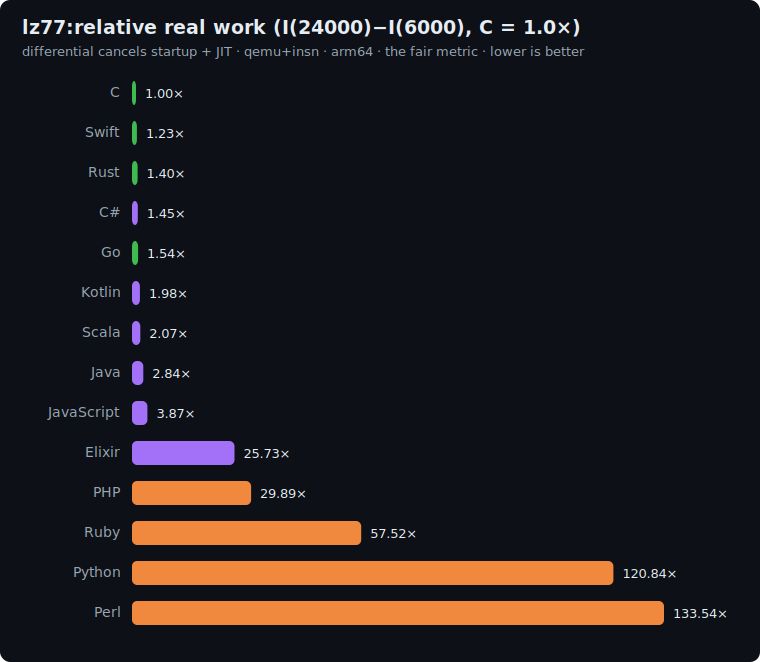

# lz77: study

The data-compression / sliding-window axis. A hand-written **LZ77** compressor: at each position it
searches the previous `WINDOW` bytes for the longest match of the lookahead and emits either a
`(distance, length)` back-reference or a literal. The hot path (a **sliding-window longest-match
search** with greedy parsing) is a memory-access and comparison shape none of the other benchmarks
have (the closest, sort-search, is random-access; this is windowed scanning with variable advance).

## The algorithm

```
WINDOW = 512 ; MIN_MATCH = 3 ; MAX_MATCH = 255 ; ALPHA = 6 ; P = 1000000007

# generate N bytes from a small alphabet (so matches are common) with the pinned LCG
state = 42
for i in 0..N-1: state = (state*1103515245 + 12345) AND 0x7fffffff ; in[i] = state mod 6

pos = 0 ; h = 0
while pos < N:
    bestLen = 0 ; bestDist = 0
    start = max(0, pos - WINDOW)
    for cand = pos-1 down to start:                 # nearest distance first
        len = 0
        while pos+len < N and len < MAX_MATCH and in[cand+len] == in[pos+len]: len += 1
        if len > bestLen: bestLen = len ; bestDist = pos - cand   # strict > : closest wins ties
    if bestLen >= MIN_MATCH:                          # emit a back-reference
        h = (h*31 + 1) mod P ; h = (h*31 + bestDist) mod P ; h = (h*31 + bestLen) mod P
        pos += bestLen
    else:                                            # emit a literal
        h = (h*31 + 0) mod P ; h = (h*31 + in[pos]) mod P
        pos += 1
print h                                              # line 1
print "lz77(N)"                                      # line 2
```

The checksum folds the whole token stream (markers, distances, lengths, literals), so it pins down
the exact parse. Greedy parsing advances `pos` by the match length, and overlapping matches
(`cand+len` reaching `pos`) are allowed, as in real LZ77.

**Correctness invariant:** every implementation prints the same hash.

| N | checksum |
|---|---|
| 6000 | `423979860` |
| 24000 | `850992747` |

## Fairness rules

1. **Hand-written LZ77**: the explicit window scan + greedy match above. **No** compression library
   (`zlib`, `gzip`, `LZ4`, `Compress::Zlib`), no hash-chain / suffix-tree match acceleration; the
   same brute-force `O(N·WINDOW)` longest-match search in every language.
2. **Same parameters and tie-break**: `WINDOW=512`, `MIN_MATCH=3`, `MAX_MATCH=255`, alphabet of 6,
   nearest-distance-wins-ties (scan from `pos-1` downward, update on strict `>`), greedy advance.
3. **All integer**; the only 64-bit value is the poly-hash accumulator (`h*31` ≈ 3.1e10). Bytes/
   distances/lengths fit a 32-bit int.

### Per-language buffer representation

| Language | Input buffer |
|---|---|
| C | `unsigned char[]` |
| Rust | `Vec<u8>` |
| Go | `[]byte` |
| Swift | `[UInt8]` |
| Python | `bytearray` |
| Perl | `@array` |
| PHP | `array` / string |
| Kotlin | `IntArray` / `ByteArray` |
| Scala | `Array[Int]` |
| C# | `byte[]` / `int[]` |
| Elixir | `:atomics` (flat byte array) |
| Ruby | `Array` of Integers |

## Sizes

`n1 = 6000`, `n2 = 24000` bytes. The differential `I(24000) − I(6000)` is dominated by the marginal
match-search work while cancelling startup.

## Results

Uniform qemu+insn pass, **arm64**, median of 5, differential `I(24000) − I(6000)` normalized to
**C = 1.0×**. Source: [`results/2026-06-17-arm64-lz77.json`](../../results/2026-06-17-arm64-lz77.json).
All 14 printed the identical `423979860` / `850992747` hashes.



| Language | I(6k) | I(24k) | differential | **vs C** (lower is better) | determinism |
|---|--:|--:|--:|--:|---|
| **C** | 11.1M | 45.3M | 34.2M | **1.00×** | exact |
| Swift | 24.8M | 66.7M | 41.9M | 1.23× | exact |
| Rust | 15.5M | 63.2M | 47.7M | 1.40× | exact |
| C# | 224.4M | 274.1M | 49.7M | 1.45× | jitter |
| Go | 17.1M | 69.6M | 52.5M | 1.54× | jitter |
| Kotlin | 225.5M | 293.1M | 67.6M | 1.98× | jitter |
| Scala | 697.2M | 768.0M | 70.8M | 2.07× | jitter |
| Java | 177.5M | 274.6M | 97.1M | 2.84× | jitter |
| JavaScript | 175.4M | 307.6M | 132.2M | 3.87× | jitter |
| Elixir | 2.30B | 3.18B | 879.3M | 25.73× | jitter |
| PHP | 363.0M | 1.38B | 1.02B | 29.89× | exact |
| Ruby | 907.8M | 2.87B | 1.97B | 57.52× | jitter |
| Python | 1.36B | 5.49B | 4.13B | 120.84× | jitter |
| Perl | 1.48B | 6.05B | 4.56B | 133.54× | jitter |

The longest-match search is a byte-comparison inner loop, so the compiled and JIT'd languages stay
tight (Swift 1.23×, Rust 1.40×, the rest under ~3.9×) and the interpreters pay their usual
per-operation tax (Python 121×, Perl 134×). Elixir's 25.73× reflects the `:atomics` NIF crossing on
every windowed byte read, the same penalty random-access array work costs it elsewhere.

## Reproduce

```bash
BENCH=lz77 scripts/bench-local.sh <lang>
```
