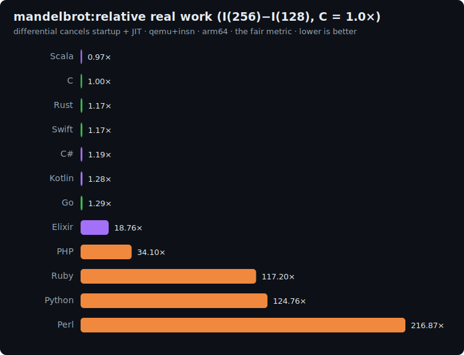

# mandelbrot: study

Floating-point benchmark from the
[Computer Language Benchmarks Game](https://benchmarksgame-team.pages.debian.net/benchmarksgame/description/mandelbrot.html).
It is the third axis of the suite: [fannkuch](../fannkuch/README.md) is integer compute,
[binary-trees](../binary-trees/README.md) is allocation + GC, and **mandelbrot is dense
IEEE-754 double-precision arithmetic**: a tight numeric inner loop with almost no memory
traffic. A language's floating-point codegen (and how well its compiler auto-vectorizes a
scalar loop) is what this measures.

## The algorithm

For each pixel of an `N × N` grid mapped onto the complex plane `[-1.5, 0.5] × [-1.0, 1.0]`,
iterate `z := z² + c` from `z = 0`, up to **50 iterations**. The pixel is **in the set** if
`|z|² = zr² + zi² ≤ 4` still holds after all 50 iterations (it never escaped). The **checksum
is the count of in-set pixels**: the popcount of the classic Mandelbrot bitmap.

```
count = 0
for y in 0..N-1:
    ci = 2.0*y/N - 1.0
    for x in 0..N-1:
        cr = 2.0*x/N - 1.5
        zr = zi = tr = ti = 0.0          # tr = zr², ti = zi²
        i = 0
        while i < 50 and tr + ti <= 4.0:
            t  = zr * zi
            zi = t + t + ci              # == 2*zr*zi + ci  (see "FMA-proof" below)
            zr = tr - ti + cr
            tr = zr * zr
            ti = zi * zi
            i += 1
        if tr + ti <= 4.0: count += 1    # never escaped → in set
```

Print the **in-set count** on line 1; `mandelbrot(N)` on line 2.

**Correctness invariant:** every implementation must print the same count, which is only
possible if every implementation computes the *bit-identical* IEEE-754 double result.

| N | in-set count |
|---|---|
| 128 | `6518` |
| 256 | `26004` |

### Why `t + t` instead of `2.0*zr*zi` (FMA-proof)

The one term that could break cross-language reproducibility is `2.0*zr*zi + ci`: it is a
multiply-add, which some toolchains **fuse** into a single `fma()` (one rounding instead of
two). C (GCC `-ffp-contract=fast`) and Go fuse it; the JVM, CLR, and the interpreters do not.
A fused vs unfused result differs in the last bit, which flips boundary pixels and changes the
count. We sidestep it entirely: `t = zr*zi; zi = t + t + ci` has **no multiply adjacent to an
add**, so no FMA contraction is possible in any language. And `t + t` is *exactly* `2.0*t`
for any finite double (it only adjusts the exponent). The result is identical bit-for-bit
everywhere, by construction, without relying on per-compiler flags.

## Fairness rules

The benchmark measures floating-point compute, so the rules protect that:

1. **IEEE-754 `double` (binary64) everywhere.** No `float`/single precision, no 80-bit x87
   extended precision, no fixed-point. The same 64-bit arithmetic in every language.
2. **The exact scalar formulation above**, including the `t + t` FMA-proof rewrite, the
   iteration cap of 50, the escape test `≤ 4.0`, and the `[-1.5, 0.5] × [-1.0, 1.0]` mapping.
3. **No hand-written SIMD / vector intrinsics.** The point is the language+compiler's codegen
   on a *scalar* loop, not who has the nicest intrinsics. **Compiler auto-vectorization is
   allowed** (it is part of what the toolchain delivers and, without FMA, preserves the bits).
4. **No `-ffast-math`** or equivalent (`/fp:fast`, unsafe-math): it would reorder/contract the
   arithmetic and diverge from the invariant.
5. **No analytic shortcut / precomputed table**: actually iterate every pixel.

### Per-language floating-point type

Each language uses its native 64-bit double; documented here to pre-empt the
"language vs implementation" critique.

| Language | Double type | Notes |
|---|---|---|
| C | `double` | `gcc -O2`; `t+t` keeps it FMA-free without needing `-ffp-contract=off` |
| Rust | `f64` | LLVM does not contract without explicit `mul_add`/fast-math |
| Go | `float64` | `t+t` avoids the compiler's `a*b+c` → FMA fusion on arm64/amd64 |
| Swift | `Double` | LLVM, no contraction without `-ffast-math` |
| Python | `float` | CPython `float` is C `double`; each op separately rounded |
| Perl | NV | `double` build (standard); each op separately rounded |
| PHP | `float` | zend `double`; each op separately rounded |
| Kotlin | `Double` | JVM never auto-fuses (needs `Math.fma`) |
| Scala | `Double` | JVM, same |
| C# | `double` | CLR does not auto-fuse |
| Elixir | `float` | BEAM `float` is IEEE double; each op separately rounded |
| Ruby | `Float` | MRI `Float` is C `double`; each op separately rounded |

## Sizes

`n1 = 128`, `n2 = 256` (grid edge). Work scales as `N² × iterations`, so the differential
`I(256) − I(128)` is dominated by the marginal floating-point work while cancelling startup +
JIT. Tunable up for a stronger signal if the slow interpreters stay tractable under qemu.

## Results

Uniform qemu+insn pass, **arm64**, median of 5, differential `I(256) − I(128)` normalized to
**C = 1.0×**. Source: [`results/2026-06-17-arm64-mandelbrot.json`](../../results/2026-06-17-arm64-mandelbrot.json).
All 12 printed the identical `6518` / `26004` counts; the FMA-proof formulation holds across
every toolchain.



| Language | I(128) | I(256) | differential | **vs C** (lower is better) | determinism |
|---|--:|--:|--:|--:|---|
| Scala | 669.9M | 683.4M | 13.5M | **0.97×** | jitter |
| **C** | 4.7M | 18.6M | 13.9M | **1.00×** | exact |
| Rust | 5.6M | 21.8M | 16.3M | 1.17× | exact |
| Swift | 16.7M | 33.0M | 16.3M | 1.17× | exact |
| C# | 212.1M | 228.7M | 16.6M | 1.19× | jitter |
| Kotlin | 193.5M | 211.4M | 17.8M | 1.28× | jitter |
| Go | 6.2M | 24.2M | 17.9M | 1.29× | jitter |
| JavaScript | 146.0M | 180.2M | 34.2M | 2.45× | jitter |
| Java | 141.5M | 183.1M | 41.7M | 2.99× | jitter |
| Elixir | 2.05B | 2.31B | 261.2M | 18.76× | jitter |
| PHP | 192.8M | 667.4M | 474.6M | 34.10× | exact |
| Ruby | 825.5M | 2.46B | 1.63B | 117.20× | jitter |
| Python | 620.0M | 2.36B | 1.74B | 124.76× | jitter |
| Perl | 1.02B | 4.04B | 3.02B | 216.87× | jitter |

### The headline: compiled/JIT codegen converges; interpreters detonate

On a tight floating-point loop the seven compiled or JIT-compiled languages cluster **within
~30% of C** (Scala 0.97×, Rust 1.17×, Swift 1.17×, C# 1.19×, Kotlin 1.28×, Go 1.29×). For
scalar `double` arithmetic the JVM and CLR JITs emit essentially the same SSE/NEON code a C
compiler does. Scala's hot loop even edges *below* C once the JIT warms (the differential
strips the warm-up). Swift, 3.42× on fannkuch's bounds-checked integer loops, falls to 1.17×
here: no arrays, no ARC, just registers of doubles.

The interpreters tell the opposite story: floating-point is their **worst** axis. Every
`double` is boxed and every operation is a dynamically-dispatched call: PHP 34×, Python 125×,
Perl **217×** (its heaviest result of any interpreter, and the slowest cell on this axis).
Elixir's 18.76× sits between: the BEAM boxes floats on its heap but its JIT (BEAMAsm) recovers
a lot.

### Why this benchmark earns its place: the three-axis picture

Each benchmark reorders the field, because each stresses a different part of the runtime.
Differential vs C = 1.0× on all three:

| Language | fannkuch (integer) | binary-trees (allocation) | mandelbrot (float) |
|---|--:|--:|--:|
| **Rust** | 1.14× | 1.19× | 1.17× |
| Go | 1.49× | 1.09× | 1.29× |
| C# | 1.61× | 0.45× | 1.19× |
| Swift | 3.42× | 1.72× | 1.17× |
| Scala | 2.73× | 0.28× | 0.97× |
| Kotlin | 3.34× | 0.28× | 1.28× |
| Elixir | 29.71× | 0.30× | 18.76× |
| PHP | 33.62× | 5.75× | 34.10× |
| Ruby | 104.64× | 10.34× | 117.20× |
| Python | 69.57× | 11.15× | 124.76× |
| Perl | 189.62× | 18.98× | 216.87× |

What the third column reveals that the first two could not:
- **Rust is the only language flat across all three axes** (1.14 / 1.19 / 1.17): the
  "no surprises anywhere" profile, the cost of zero-overhead abstractions paying off uniformly.
- **The JVM (Scala/Kotlin) is a specialist**, not a generalist: superb at allocation (0.28×) and
  float (~1×), but its integer/array work on fannkuch (2.7–3.3×) lags, the inverse of what a
  one-benchmark verdict would suggest.
- **Elixir** is the most workload-dependent of all: 29.71× / 0.30× / 18.76×. Brilliant at
  garbage-collected allocation, poor at raw integer and boxed-float compute.
- **Swift** swings from 3.42× (fannkuch) to 1.17× (mandelbrot): its overhead is allocation and
  bounds-checking, not arithmetic.

A single benchmark would have ranked any of these languages confidently and **wrongly**. That is
the entire argument for the suite.

## Reproduce

```bash
BENCH=mandelbrot scripts/bench-local.sh <lang>
```
