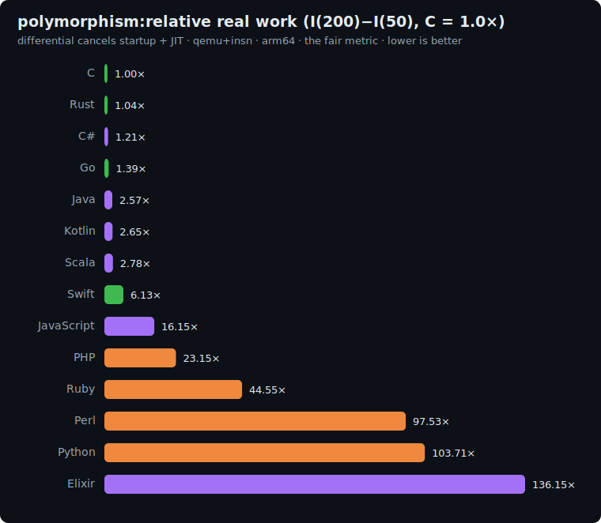

# polymorphism: study

The **dynamic-dispatch / virtual-call-overhead** axis. `tak` measured the cost of a *static*
call; this measures the cost of a call whose target is resolved at **runtime** from the object's
type. That runtime method resolution is the defining cost of OOP and dynamic languages, and it is
invisible everywhere else in the suite. Together the two axes bracket the full cost of "a call".

## The algorithm

- **N = 10000 objects**, each of one of **K = 6 concrete types**. Every type has the SAME three
  integer fields `a, b, c` but its OWN `apply(x)` method (a distinct integer transform). Objects
  are generated by an LCG (the type from the high bits, the fields mod 1000) and kept in
  generation order.
- Fold an accumulator through every object, **M passes**: `acc = obj.apply(acc)`. Which `apply`
  runs is decided at runtime by the object's type.
- Output: line 1 = the final `acc` (checksum); line 2 = `polymorphism(M)`.

Two design choices make this an HONEST dispatch measurement, not a measurement of something the
compiler can fold away:

- **Megamorphic.** K = 6 types in an unpredictable order defeats devirtualization and polymorphic
  inline caches (typically <= 4 entries), so every call site stays a real runtime dispatch. The
  type is taken from the LCG's high bits because its low bits correlate (all six types must be
  used, roughly evenly).
- **No hoisting / no shortcut.** `acc` threads through every call (a strict data dependency) and
  each `apply` uses a large distinct multiplier, so the per-pass map never reaches a fixed point.
  The checksum therefore depends on M, which means the N*M dispatches cannot be precomputed,
  cached, or skipped (an early version with small multipliers converged to a fixed point and was
  rejected exactly because the checksum stopped depending on M).

**Correctness invariant** (dual reference: C and Python independently produce these):

| M (passes) | checksum (line 1) |
|---|--:|
| 50 | `774510903` |
| 200 | `331867123` |

## Fairness rules

- Each of the K = 6 types uses the language's **idiomatic runtime polymorphism**: virtual /
  abstract methods (Kotlin, Scala, C#, Swift), interface dispatch (Go), trait objects `dyn`
  (Rust), duck-typed methods (Python, Ruby, PHP, Perl), protocols (Elixir).
- **FORBIDDEN:** a source-level type tag plus a `switch` / `if`-chain. That is manual branch
  dispatch, not polymorphism, and would measure a branch instead of a runtime method resolution.
  No memoization of `apply` results.
- The **megamorphic order is preserved** (objects stay in LCG generation order; they are NOT
  sorted by type, which would let a JIT see one type per run and devirtualize).
- **Documented asymmetry (the fair non-OOP equivalent).** **C** has no objects, so each object
  stores a **function pointer** (its vtable equivalent) and the call is `obj->apply(obj, acc)` --
  a genuine runtime-data-driven indirect call (the faithful analogue of a vtable), NOT a branch.
  This is the same kind of explicitly-documented, allowed asymmetry as k-nucleotide's inline-key
  C FNV table.
- Same N, K, LCG, per-type formulas and fold order across all languages; all integer, mod 1e9+7.

## Sizes

`n1 = 50`, `n2 = 200` passes (N = 10000 objects, fixed). The differential `I(200) - I(50)`
isolates the marginal `150 * 10000 = 1.5M` dispatches, cancelling object construction and JIT
warm-up.

## Representation per language (the dispatch mechanism)

| Language | Polymorphism mechanism |
|---|---|
| C | per-object `apply` **function pointer** (vtable equivalent), `obj->apply(obj, x)` |
| Rust | `Box<dyn Apply>` trait objects, dynamic `obj.apply(x)` |
| Go | an `interface` with `apply(int64) int64`, slice of interface values |
| Swift | a `protocol` (or base class) with a method, array of existentials |
| Python / Ruby / PHP / Perl | duck-typed method call on six classes |
| Kotlin / Scala / C# | abstract/virtual method, array of the base type |
| Elixir | a protocol (or behaviour) dispatched per struct |

## Results

Single backend (`qemu-insn`), same ISA (arm64 local). Raw data in
[`results/2026-06-20-arm64-polymorphism.json`](../../results/2026-06-20-arm64-polymorphism.json).

### The fair metric: real work `I(200) - I(50)`, normalized to C = 1.0x (lower is better)

The absolute count includes the runtime's startup, which varies wildly across runtimes. The
differential between the two sizes cancels it (and JIT compilation), isolating the algorithm's real
work. C (gcc `-O2`, no GC) is the reference floor; below 1.0x beats C.



| Language | I(50) | I(200) | differential | **vs C** (lower is better) | determinism |
|---|--:|--:|--:|--:|---|
| **C** | 12.3M | 47.8M | 35.5M | **1.00×** | exact |
| Rust | 16.7M | 53.7M | 37.0M | 1.04× | exact |
| C# | 226.8M | 269.8M | 43.0M | 1.21× | jitter |
| Go | 19.5M | 69.0M | 49.5M | 1.39× | jitter |
| Kotlin | 233.2M | 327.2M | 93.9M | 2.65× | jitter |
| Scala | 690.1M | 788.7M | 98.6M | 2.78× | jitter |
| Swift | 87.8M | 305.7M | 217.8M | 6.13× | exact |
| PHP | 340.5M | 1.16B | 822.2M | 23.15× | exact |
| Ruby | 856.2M | 2.44B | 1.58B | 44.55× | jitter |
| Perl | 1.30B | 4.76B | 3.46B | 97.53× | jitter |
| Python | 1.48B | 5.16B | 3.68B | 103.71× | jitter |
| Elixir | 4.43B | 9.26B | 4.83B | 136.15× | jitter |

## Reproduce

```bash
BENCH=polymorphism scripts/bench-local.sh <lang>
python3 scripts/make_charts.py results/<date>-<isa>-polymorphism.json
```
