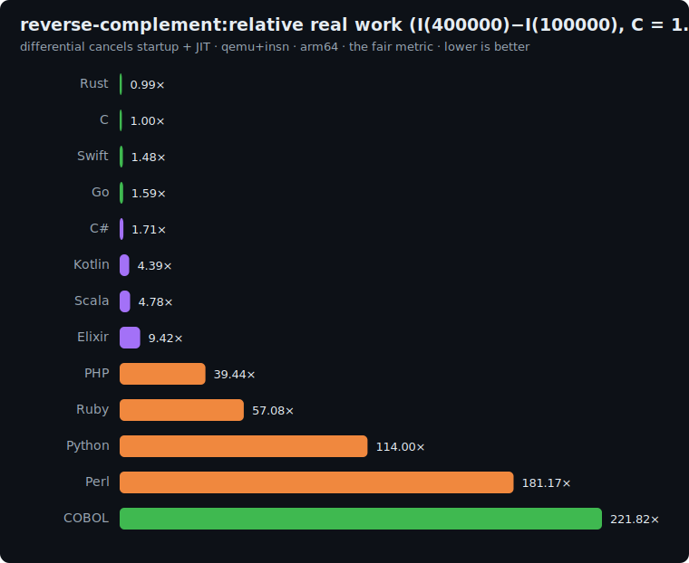

# reverse-complement: study

String / byte-processing benchmark, adapted from the
[Computer Language Benchmarks Game](https://benchmarksgame-team.pages.debian.net/benchmarksgame/description/revcomp.html).
It is the fifth axis of the suite, the one none of the others touch: **per-character text
processing**. Where [fannkuch](../fannkuch/README.md) is integer compute,
[binary-trees](../binary-trees/README.md) allocation, [mandelbrot](../mandelbrot/README.md)
floating-point and [k-nucleotide](../k-nucleotide/README.md) hashing, this measures how cheaply a
language pushes **characters through a tight transform loop**: the bread and butter of parsers,
formatters and serializers.

## The algorithm

Generate a DNA sequence of length `L`, reverse it while complementing each base
(`A↔T`, `C↔G`), then reduce the result to a polynomial string hash.

```
# 1. Deterministic DNA via an integer LCG (same generator as k-nucleotide; NO floating point)
seed = 42
for i in 0..L-1:
    seed = (seed * 3877 + 29573) mod 139968
    S[i] = 'A' if seed<42000 ; 'C' if seed<70000 ; 'G' if seed<98000 ; else 'T'

# 2. Reverse-and-complement IN PLACE with a hand-written two-pointer loop
i = 0, j = L-1
while i < j:
    a = comp(S[i]); S[i] = comp(S[j]); S[j] = a; i += 1; j -= 1   # comp: A<->T, C<->G
if i == j: S[i] = comp(S[i])                                       # middle char when L is odd

# 3. Polynomial string hash over the reverse-complemented sequence (hand-written, left to right)
h = 0
for c in S:                       # c is the ASCII byte value: A=65, C=67, G=71, T=84
    h = (h * 31 + c) mod 1000000007
print h                           # line 1
print "reverse-complement(L)"     # line 2
```

The hash is an ordered polynomial (`h = h*31 + byte`, the classic Java-`String.hashCode` shape),
so it pins down the **exact** reverse-complemented sequence position by position.

**Correctness invariant:** every implementation must print the same hash.

| L | checksum |
|---|---|
| 100000 | `827974717` |
| 400000 | `533032773` |

## Fairness rules

The benchmark measures **per-character processing**, so the rules keep it a language-level loop,
not a library call:

1. **Hand-written loops only.** The reverse-and-complement is the explicit two-pointer loop above;
   the hash is the explicit per-character loop. **No** stdlib bulk reverse (`reversed`, `[::-1]`,
   `.reverse()`, `Array.Reverse`), **no** `str.translate`/`tr`-style batch map, **no** builtin
   `hashCode`/`hash()`. This is the same no-stdlib-shortcut rule fannkuch uses for its prefix
   reversal. It measures the *language*, not who wraps the fastest C primitive.
2. **A mutable byte/char buffer**, not naive immutable-string concatenation (which would be
   `O(L²)` and would measure the wrong thing). Each language uses its idiomatic mutable buffer.
3. **Same generator + transform**: the integer LCG `(seed*3877+29573) mod 139968` from `seed=42`,
   the `42000/70000/98000` thresholds, the `A↔T`/`C↔G` complement, and the hash `h = h*31 + byte`
   over the **ASCII** byte value (A=65, C=67, G=71, T=84), mod `1e9+7`.
4. **64-bit hash arithmetic**: `h*31` reaches ~3.1e10, so `h`, the product, and `P` must be 64-bit.
5. **All integer**: no floating point anywhere.

### Per-language buffer representation

| Language | Mutable buffer | In-place? |
|---|---|---|
| C | `char[]` | yes |
| Rust | `Vec<u8>` | yes |
| Go | `[]byte` | yes |
| Swift | `[UInt8]` | yes |
| Python | `bytearray` | yes (str is immutable; bytearray is not) |
| Perl | string (`substr`/`vec`) or char array | yes (Perl strings are mutable) |
| PHP | string (`$s[$i]` is assignable) | yes (PHP strings are mutable by index) |
| Kotlin | `CharArray` / `ByteArray` | yes |
| Scala | `Array[Byte]` | yes |
| C# | `char[]` / `byte[]` | yes |
| Elixir | charlist, folded into a new reversed list | no: immutable; idiomatic fold |

## Sizes

`n1 = 100000`, `n2 = 400000` (sequence length). The differential `I(400000) − I(100000)` is
dominated by the marginal per-character work (reverse + complement + hash) while cancelling
startup + JIT.

## Results

Uniform qemu+insn pass, **arm64**, median of 5, differential `I(400000) − I(100000)` normalized
to **C = 1.0×**. Source: [`results/2026-06-17-arm64-reverse-complement.json`](../../results/2026-06-17-arm64-reverse-complement.json).
All 11 printed the identical `827974717` / `533032773` hashes.



| Language | I(100k) | I(400k) | differential | **vs C** | determinism |
|---|--:|--:|--:|--:|---|
| Rust | 3.9M | 15.0M | 11.1M | **0.99×** | exact |
| **C** | 3.8M | 15.1M | 11.3M | **1.00×** | exact |
| Swift | 16.9M | 33.5M | 16.7M | 1.48× | exact |
| Go | 6.3M | 24.2M | 17.9M | 1.59× | jitter |
| C# | 214.9M | 234.2M | 19.3M | 1.71× | jitter |
| Kotlin | 195.2M | 244.6M | 49.4M | 4.39× | jitter |
| Scala | 657.1M | 710.9M | 53.8M | 4.78× | jitter |
| Elixir | 1.99B | 2.10B | 105.9M | 9.42× | jitter |
| PHP | 182.6M | 626.3M | 443.7M | 39.44× | exact |
| Python | 468.9M | 1.75B | 1.28B | 114.00× | jitter |
| Perl | 693.6M | 2.73B | 2.04B | 181.17× | jitter |

### The headline: the hand-written-loop rule exposes the interpreters

By forbidding `str.translate` / `[::-1]` / `strrev` (the C-level batch primitives an interpreter
would normally reach for), the benchmark forces a genuine per-character loop in every language, and
that is where Python (114×), Perl (181×) and PHP (39×) detonate: each character costs a full
interpreter dispatch. This is the honest cost of *the language* processing text, not the cost of
its C runtime's `memcpy`. **Rust ties C (0.99×)**: a `Vec<u8>` index loop lowers to exactly the
same machine code, and it is back to its flat profile here (its 2.73× on k-nucleotide was a
hash-map-specific SipHash tax, not a string weakness). Swift (1.48×), Go (1.59×) and C# (1.71×)
sit just behind on tight native/JIT byte buffers.

The surprise is the **JVM (Kotlin 4.39×, Scala 4.78×)**: stellar at allocation and floating point,
it is *mediocre* at a per-character loop. Its `CharArray` is 16-bit UTF-16 and the JIT does not
tighten this byte-shuffling loop the way the CLR does its 8-bit `byte[]` (C# 1.71×), a concrete
case of "managed" not being one number. Elixir's 9.42× is its **second-best** axis: building a
reversed charlist by prepending cons cells is exactly what the BEAM is built for.

### The five-axis picture: the whole thesis in one table

Differential vs C = 1.0× across the entire suite:

| Language | fannkuch (int) | binary-trees (alloc) | mandelbrot (float) | k-nucleotide (hash) | reverse-complement (string) |
|---|--:|--:|--:|--:|--:|
| **Rust** | 1.14× | 1.19× | 1.17× | 2.73× | 0.99× |
| Go | 1.49× | 1.09× | 1.29× | 4.93× | 1.59× |
| C# | 1.61× | 0.45× | 1.19× | 9.73× | 1.71× |
| Swift | 4.75× | 1.72× | 1.17× | 9.67× | 1.48× |
| Kotlin | 3.34× | 0.28× | 1.28× | 9.98× | 4.39× |
| Scala | 2.73× | 0.28× | 0.97× | 10.53× | 4.78× |
| Elixir | 29.71× | 0.30× | 18.76× | 39.64× | 9.42× |
| PHP | 33.62× | 5.75× | 34.10× | 16.02× | 39.44× |
| Python | 69.57× | 11.15× | 124.76× | 49.80× | 114.00× |
| Perl | 189.62× | 18.98× | 216.87× | 36.40× | 181.17× |

Read the rows, not the cells:
- **Rust** is the only language within ~3× of C on *every* axis (and at-or-below C on four of five):
  the genuinely flat profile, the one "no surprises anywhere" language.
- **The JVM (Kotlin/Scala)** is a study in extremes: best-in-class at allocation (0.28×), competitive
  at float (~1×), but 3–5× at integer-array (fannkuch) and string work. A specialist wearing a
  generalist's reputation.
- **Swift** inverts between axes (4.75× fannkuch → 1.17–1.48× float/string): its overhead lives in
  array bounds-checks and ARC, not arithmetic or bytes.
- **The interpreters** are never fast, but *where* they are least-bad differs sharply: PHP and Perl
  shine (relatively) at hash maps (their native-C associative array), and crater at compute and
  per-character loops.

Five benchmarks, **five different orderings of the same eleven languages**. There is no scalar
"speed of a language": only a speed *at a kind of work*. That is the entire reason lang-lab is a
suite.

## Reproduce

```bash
BENCH=reverse-complement scripts/bench-local.sh <lang>
```
