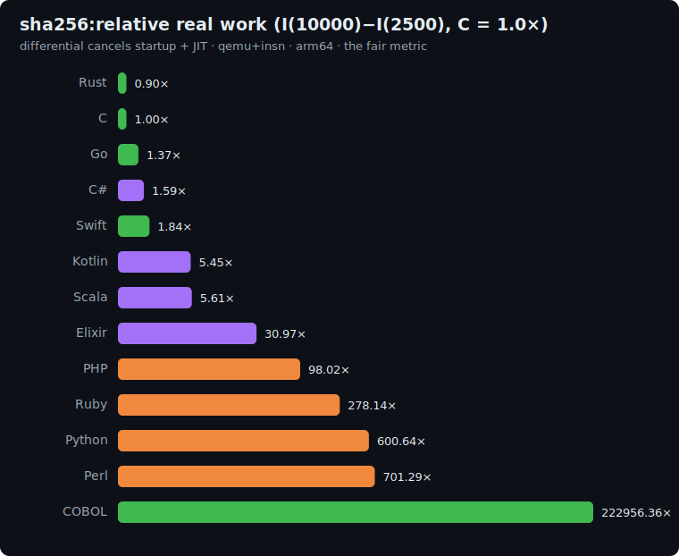

# sha256: study

The bit-manipulation / cryptography axis of the suite: **real FIPS 180-4 SHA-256**, applied
iteratively. Its hot path (32-bit rotations, XOR, shifts and modular `2^32` addition, 64 rounds
per block) is work no other benchmark touches: no allocation, no floating point, no data
structures, just **register-level bit twiddling**, the shape of every hash, checksum, MAC and
password-stretch a backend runs.

## The algorithm

Start from a 32-byte digest seeded by the LCG, then hash it with SHA-256 **N times** (each hash is
one padded 512-bit block). Reduce the final 32-byte digest to a polynomial hash.

```
# 1. Seed a 32-byte digest with the pinned LCG
state = 42
for i in 0..31: state = (state*1103515245 + 12345) AND 0x7fffffff ; digest[i] = state mod 256

# 2. Apply real SHA-256 N times (in place)
repeat N times: digest = SHA256(digest)        # 32-byte input -> one padded block -> 32-byte digest

# 3. Checksum: polynomial hash of the final digest
h = 0
for b in digest: h = (h*31 + b) mod 1000000007
print h                                         # line 1
print "sha256(N)"                               # line 2
```

`SHA256` is the standard algorithm: the eight `H0` init words, the 64 round constants `K`, the
16→64 word message schedule, and 64 compression rounds of `Σ0/Σ1/ch/maj` over working variables
`a..h`, all in **unsigned 32-bit** arithmetic. The reference implementation in
[`languages/c/sha256.c`](../../languages/c/sha256.c) is verified against the published
`SHA256("abc") = ba7816bf…f20015ad` test vector, so this is genuine SHA-256, not a look-alike.

**Correctness invariant:** every implementation prints the same hash.

| N | checksum |
|---|---|
| 2500 | `720457911` |
| 10000 | `506466333` |

## Fairness rules

1. **Hand-written SHA-256**: the compression function above. **No** crypto/hashing library
   (`hashlib`, `crypto`, `MessageDigest`, `System.Security.Cryptography`, `:crypto`, OpenSSL),
   **no** SHA hardware intrinsics. Plain scalar bit operations.
2. **Unsigned 32-bit arithmetic is mandatory.** Every add wraps mod `2^32` and every right shift is
   **logical** (zero-fill). Use the native unsigned 32-bit type where there is one (`uint32_t`,
   `u32`, `uint32`, `UInt32`, `uint`); in languages without one, **mask with `& 0xFFFFFFFF` after
   every operation** and use a logical right shift (`ushr` / `>>>` / `bsr` / shift of a masked
   non-negative value). A signed shift or an un-masked add gives a different digest.
3. **Exact constants and padding**: the standard `H0`/`K`, big-endian word packing, and the
   single-block padding for a 32-byte message (`0x80`, zeros, 64-bit length = 256).
4. All integer; the only 64-bit value is the final poly-hash accumulator (`h*31` ≈ 3.1e10).

### Per-language 32-bit representation

| Language | 32-bit words |
|---|---|
| C | `uint32_t` |
| Rust | `u32` (`wrapping_add`) |
| Go | `uint32` |
| Swift | `UInt32` (`&+`) |
| C# | `uint` |
| Kotlin | `Int` + `ushr` (logical shift) |
| Scala | `Int` + `>>>` (logical shift) |
| Python | `int`, masked `& 0xFFFFFFFF` |
| Perl | `int`, masked `& 0xFFFFFFFF` |
| PHP | `int`, masked `& 0xFFFFFFFF` |
| Elixir | `int`, `Bitwise.band(_, 0xFFFFFFFF)`, `bsr`/`bsl` |
| Ruby | `Integer`, masked `& 0xFFFFFFFF`, logical `>>` (non-negative shift) |

## Sizes

`n1 = 2500`, `n2 = 10000` SHA-256 iterations. Work is linear in N (one block compression each), so
the differential `I(10000) − I(2500)` is dominated by the marginal compression work.

## Results

Uniform qemu+insn pass, **arm64**, median of 5, differential `I(10000) − I(2500)` normalized to
**C = 1.0×**. Source: [`results/2026-06-17-arm64-sha256.json`](../../results/2026-06-17-arm64-sha256.json).
All 12 printed the identical `720457911` / `506466333` hashes.



| Language | I(2.5k) | I(10k) | differential | **vs C** (lower is better) | determinism |
|---|--:|--:|--:|--:|---|
| Rust | 7.6M | 30.1M | 22.4M | **0.90×** | exact |
| **C** | 8.4M | 33.3M | 24.9M | **1.00×** | exact |
| Go | 11.7M | 45.9M | 34.2M | 1.37× | jitter |
| C# | 229.8M | 269.5M | 39.6M | 1.59× | jitter |
| Swift | 26.6M | 72.4M | 45.8M | 1.84× | exact |
| Kotlin | 228.3M | 364.2M | 135.9M | 5.45× | jitter |
| Scala | 715.3M | 855.3M | 140.1M | 5.61× | jitter |
| Elixir | 2.43B | 3.21B | 772.6M | 30.97× | jitter |
| PHP | 850.3M | 3.30B | 2.45B | 98.02× | exact |
| Ruby | 2.59B | 9.53B | 6.94B | 278.14× | jitter |
| Python | 5.04B | 20.0B | 15.0B | 600.64× | jitter |
| Perl | 5.85B | 23.3B | 17.5B | 701.29× | jitter |

### The headline: no native 32-bit integer is catastrophic

The whole benchmark turns on one rule: every operation is **unsigned 32-bit**. Rust (0.90×, beating
C), C, Go, C# and Swift all have a native `u32`/`uint` whose adds wrap and whose shifts are free, so
they sit at 0.9–1.8×.
The languages with **no native 32-bit type pay for it on every single operation**: Python (`600×`) and
Perl (`701×`) (their worst results anywhere by a wide margin) must do a full arbitrary-precision
`& 0xFFFFFFFF` after *every* add, XOR, rotate and shift, and SHA-256 is nothing but those. Python's
arbitrary-precision integers, a strength on a bignum workload, are a **catastrophe** on fixed-width
bit-twiddling; PHP (98×) fares better only because its int is a fixed 64-bit. The JVM (Kotlin/Scala
~5.5×) is mid-pack: `Int` is exactly 32 bits and wraps for free, but it pays the usual JIT overhead on
the tight round loop.

### The ten-axis picture: the full suite

Differential vs C = 1.0× across all ten benchmarks (int / alloc / float / hash / string / algorithms /
graph / image / ML / crypto):

| Lang | fann | btree | mand | knuc | revc | sort | dijk | blur | kmns | sha |
|---|--:|--:|--:|--:|--:|--:|--:|--:|--:|--:|
| **Rust** | 1.14 | 1.19 | 1.17 | 2.73 | 0.99 | 1.34 | 2.22 | **0.48** | **0.59** | **0.90** |
| Go | 1.49 | 1.09 | 1.29 | 4.93 | 1.59 | 1.41 | 2.72 | 1.23 | 1.68 | 1.37 |
| C# | 1.61 | 0.45 | 1.19 | 9.73 | 1.71 | 1.46 | 1.94 | 1.01 | 1.41 | 1.59 |
| Swift | 3.42 | 1.72 | 1.17 | 9.67 | 1.48 | 1.89 | 2.29 | 0.56 | 2.49 | 1.84 |
| Scala | 2.73 | 0.28 | 0.97 | 10.53 | 4.78 | 3.10 | 5.66 | 3.32 | 3.89 | 5.61 |
| Kotlin | 3.34 | 0.28 | 1.28 | 9.98 | 4.39 | 3.55 | 4.95 | 3.28 | 6.76 | 5.45 |
| Elixir | 29.71 | 0.30 | 18.76 | 39.64 | 9.42 | 36.47 | 56.47 | 15.49 | 39.07 | 30.97 |
| PHP | 33.62 | 5.75 | 34.10 | 16.02 | 39.44 | 39.28 | 36.54 | 43.03 | 47.18 | 98.02 |
| Ruby | 104.64 | 10.34 | 117.20 | 56.39 | 57.08 | 79.91 | 77.28 | 115.20 | 91.12 | 278.14 |
| Python | 69.57 | 11.15 | 124.76 | 49.80 | 114.00 | 131.93 | 92.92 | 120.91 | 149.26 | 600.64 |
| Perl | 189.62 | 18.98 | 216.87 | 36.40 | 181.17 | 189.53 | 155.46 | 264.40 | 203.14 | 701.29 |

Ten benchmarks, ten orderings, the thesis, conclusively:

- **C wins eight of ten**, but loses both vectorizable axes (blur, k-means) and ties-then-loses to Rust
  on crypto. A `gcc -O3` build would narrow those; the suite pins idiomatic `-O2`.
- **Rust** is the only language to beat C on **four** axes (rev-comp, blur, k-means, sha256) and never
  exceeds 2.73×: the one language that is never the wrong default.
- **The same row spans up to ~190×** (Elixir 0.30× → 56.47×). Averaging that into one "language
  speed" number would be not just imprecise but actively misleading.
- **Each language has a fingerprint, not a rank**: the JVM's allocation supremacy, C#'s even keel,
  Elixir's functional-vs-imperative split, Python/Perl's bignum cliff on fixed-width bits. The suite
  measures *shape*, and shape is the only honest thing to measure.

**There is no single speed of a language. Ten axes prove it.**

## Reproduce

```bash
BENCH=sha256 scripts/bench-local.sh <lang>
```
