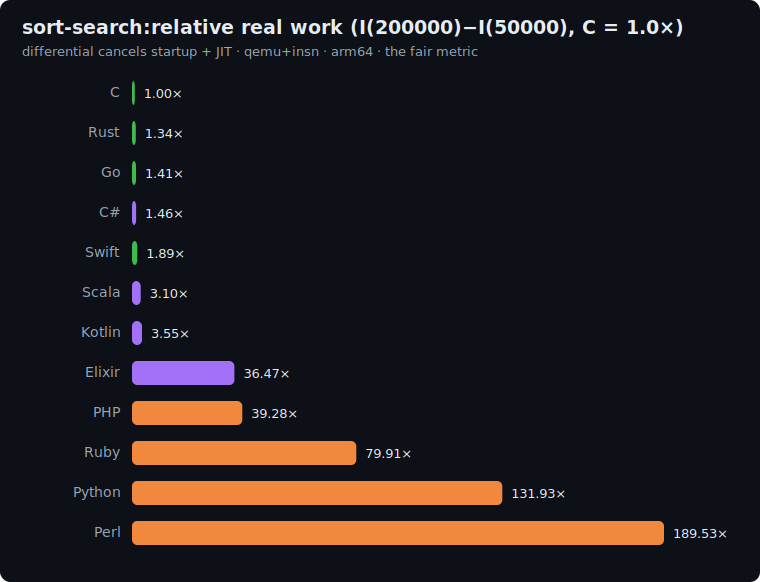

# sort-search: study

The textbook algorithms axis: **quicksort + binary search**, written out by hand. Where the other
five benchmarks each isolate a runtime *capability* ([fannkuch](../fannkuch/README.md) integer,
[binary-trees](../binary-trees/README.md) allocation, [mandelbrot](../mandelbrot/README.md) float,
[k-nucleotide](../k-nucleotide/README.md) hashing, [reverse-complement](../reverse-complement/README.md)
strings), this one isolates **the language executing the two most classic algorithms**: recursion,
partitioning, comparisons and `O(log n)` probing over a mutable array.

We implement the algorithms ourselves (no `qsort` / `Arrays.sort` / `.sort()` / `bsearch`) so the
benchmark measures the *language running the same algorithm*, not whichever sort its standard
library happens to ship: the same no-stdlib-shortcut rule fannkuch and reverse-complement use.

## The algorithm

```
P = 1000000007

# 1. Generate N integers with a pinned LCG (glibc-style; 64-bit multiply, mask to 31 bits)
state = 42
for i in 0..N-1:
    state = (state * 1103515245 + 12345) AND 0x7fffffff
    A[i] = state

# 2. Sort A ascending with a hand-written median-of-three quicksort (Hoare partition)
qsort(lo, hi):                       # inclusive bounds
    if lo >= hi: return
    mid = lo + (hi - lo) / 2          # INTEGER division (floor)
    if A[mid] < A[lo]: swap(lo, mid)  # median-of-three: median ends up at A[mid]
    if A[hi]  < A[lo]: swap(lo, hi)
    if A[hi]  < A[mid]: swap(mid, hi)
    pivot = A[mid]
    i = lo - 1; j = hi + 1
    loop forever:
        do i += 1 while A[i] < pivot   # Hoare scan from both ends
        do j -= 1 while A[j] > pivot
        if i >= j: break
        swap(i, j)
    qsort(lo, j); qsort(j + 1, hi)     # recurse both sides; depth stays ~log N (≤ 32 here)

# 3. N binary searches (all hits: keys are drawn from the sorted array), folded into a checksum
h = 0
for q in 0..N-1:
    state = (state * 1103515245 + 12345) AND 0x7fffffff   # continue the SAME LCG stream
    key = A[state mod N]              # a value that IS in the sorted array
    idx = bsearch(key)               # pinned binary search below
    h = (h * 31 + (idx + 1)) mod P
print h                              # line 1
print "sort-search(N)"               # line 2

bsearch(key):
    lo = 0; hi = N-1
    while lo <= hi:
        mid = lo + (hi - lo) / 2      # INTEGER division
        if A[mid] < key: lo = mid + 1
        elif A[mid] > key: hi = mid - 1
        else: return mid
    return -1
```

The checksum folds in the found index of every search. A correct value is only possible if **both**
the sort produced the right order *and* the binary search probes it correctly; so the single
number validates the whole pipeline.

**Correctness invariant:** every implementation prints the same checksum.

| N | checksum |
|---|---|
| 50000 | `408844375` |
| 200000 | `110297196` |

## Fairness rules

1. **Hand-written algorithms only**: the exact quicksort and binary search above. **No** stdlib
   sort (`qsort`, `Arrays.sort`, `.sort()`, `sorted()`), **no** stdlib binary search, **no**
   priority-queue/tree shortcut. Same median-of-three pivot, same Hoare partition, same recursion
   order in every language, so the comparison/swap *sequence* is identical and only per-operation
   language cost differs.
2. **One mutable array**, sorted in place. 64-bit integer elements.
3. **Integer (floor) division** for every `/2` and the `mod N`: a frequent bug is a language whose
   `/` is float division (Python `//`, Perl `int(...)`, Elixir `div`/`rem`).
4. **64-bit arithmetic**: the LCG product `state*1103515245` reaches ~2.4e10 and `h*31` ~3.1e10, so
   the state, array elements and hash must be 64-bit.
5. **All integer**: no floating point.

### Per-language array representation

| Language | Mutable array |
|---|---|
| C | `long[]` (malloc) |
| Rust | `Vec<i64>` |
| Go | `[]int64` |
| Swift | `[Int]` |
| Python | `list` |
| Perl | `@array` |
| PHP | `array` |
| Kotlin | `LongArray` |
| Scala | `Array[Long]` |
| C# | `long[]` |
| Elixir | `:atomics` (the BEAM's mutable 64-bit integer array; in-place swaps) |
| Ruby | `Array` (`Array.new(n, 0)` of Integers, sorted in place) |
| COBOL | `PIC S9(18) COMP-5 OCCURS` table (1-indexed 64-bit ints; quicksort recursion via an explicit `OCCURS` manual stack) |

Elixir has no mutable list/tuple, so it uses `:atomics`, the honest way to run an in-place
quicksort on the BEAM (each `get`/`put` is a NIF call, which the instruction count fairly reflects).

## Sizes

`n1 = 50000`, `n2 = 200000`. Work is `O(N log N)` for the sort plus `O(N log N)` for the N
searches, so the differential `I(200000) − I(50000)` is dominated by the marginal sort+search work.

## Results

Uniform qemu+insn pass, **arm64**, median of 5, differential `I(200000) − I(50000)` normalized to
**C = 1.0×**. Source: [`results/2026-06-17-arm64-sort-search.json`](../../results/2026-06-17-arm64-sort-search.json).
All 13 printed the identical `408844375` / `110297196` checksums: the same quicksort and binary
search, operation for operation.



| Language | I(50k) | I(200k) | differential | **vs C** (lower is better) | determinism |
|---|--:|--:|--:|--:|---|
| **C** | 15.5M | 68.2M | 52.7M | **1.00×** | exact |
| Rust | 20.8M | 91.6M | 70.7M | 1.34× | exact |
| Go | 22.4M | 96.9M | 74.6M | 1.41× | jitter |
| C# | 233.9M | 310.6M | 76.8M | 1.46× | jitter |
| Swift | 40.8M | 140.3M | 99.5M | 1.89× | exact |
| Scala | 770.3M | 933.7M | 163.3M | 3.10× | jitter |
| Kotlin | 280.9M | 467.8M | 186.9M | 3.55× | jitter |
| Elixir | 2.61B | 4.53B | 1.92B | 36.47× | jitter |
| PHP | 646.0M | 2.72B | 2.07B | 39.28× | exact |
| Ruby | 1.52B | 5.73B | 4.21B | 79.91× | jitter |
| Python | 2.09B | 9.04B | 6.95B | 131.93× | jitter |
| Perl | 2.97B | 13.0B | 9.99B | 189.53× | jitter |
| COBOL | 5.13B | 22.5B | 17.4B | 330.02× | exact |

### The headline: recursion + random array access, and Elixir's wall

This benchmark is mostly **array indexing, comparisons and recursion**, C's home turf, and it wins
(1.00×) with the compiled/JIT languages trailing closely (Rust 1.34×, Go 1.41×, C# 1.46×, Swift
1.89×). The JVM pays a bit more for the recursive partition over a `LongArray` (Kotlin 3.55×, Scala
3.10×), and the interpreters pay per-operation as always (PHP 39×, Python 132×, Perl 190×, almost
exactly its fannkuch number, since both are tight integer-array loops). Slowest of all is **COBOL
at 330×** - and it is *native-compiled*: GnuCOBOL emits a libcob call per statement, so even
hand-written integer array code trails every interpreter here, the suite's sharpest reminder that
compiled ≠ fast. Unlike the interpreters its counts are bit-exact.

The standout is **Elixir at 36.47×**, by far its worst showing relative to the others on any axis.
The BEAM has no mutable array, so an in-place quicksort must run on `:atomics`, where **every element
read and write is a NIF call**. A quicksort plus N binary searches is millions of random accesses,
and that per-access barrier dominates. It is the honest cost of forcing an in-place,
random-access array algorithm onto a runtime built for immutable, functional data: the mirror image
of binary-trees, where the BEAM's functional allocation made it shine (0.30×).

### The six-axis picture

Differential vs C = 1.0× across the suite:

| Language | fannkuch | binary-trees | mandelbrot | k-nucleotide | reverse-comp | sort-search |
|---|--:|--:|--:|--:|--:|--:|
| **Rust** | 1.14× | 1.19× | 1.17× | 2.73× | 0.99× | 1.34× |
| Go | 1.49× | 1.09× | 1.29× | 4.93× | 1.59× | 1.41× |
| C# | 1.61× | 0.45× | 1.19× | 9.73× | 1.71× | 1.46× |
| Swift | 4.75× | 1.72× | 1.17× | 9.67× | 1.48× | 1.89× |
| Scala | 2.73× | 0.28× | 0.97× | 10.53× | 4.78× | 3.10× |
| Kotlin | 3.34× | 0.28× | 1.28× | 9.98× | 4.39× | 3.55× |
| Elixir | 29.71× | 0.30× | 18.76× | 39.64× | 9.42× | 36.47× |
| PHP | 33.62× | 5.75× | 34.10× | 16.02× | 39.44× | 39.28× |
| Ruby | 104.64× | 10.34× | 117.20× | 1437.92× | 57.08× | 79.91× |
| Python | 69.57× | 11.15× | 124.76× | 49.80× | 114.00× | 131.93× |
| Perl | 189.62× | 18.98× | 216.87× | 36.40× | 181.17× | 189.53× |
| COBOL | 26.78× | 182.75× | 7908.42× | 7686.05× | 221.82× | 330.02× |

- **Rust** stays inside 1.0–2.7× on all six: the only language that never surprises.
- **Elixir** now shows its full split personality: best-in-class at functional allocation (0.30×),
  worst-by-far at in-place array algorithms (36.47×): a 120× spread driven entirely by *how the
  data structure fits the runtime*.
- **The JVM and the interpreters** keep their shapes: managed languages competitive except where a
  general-purpose container (its hash map, its `:atomics`) is in the hot path; interpreters uniformly
  10–200× with their relative best always on whichever axis their native-C internals do the work.
- **COBOL** is the outlier that breaks the compiled/interpreted dichotomy: native-compiled yet the
  slowest language in the suite on almost every axis (libcob call per statement), 27–330× on the
  plain integer/array loops here, and it has *cliffs* where it lacks a native primitive -
  mandelbrot 7908× (COMP-2 doubles routed through GMP arbitrary-precision DECIMAL, no FPU codegen)
  and k-nucleotide 7686× (string-keyed hashing). On sort-search it lands at 330×, behind Perl.

Six benchmarks, six orderings. The thesis only hardens with each axis added.

## Reproduce

```bash
BENCH=sort-search scripts/bench-local.sh <lang>
```
