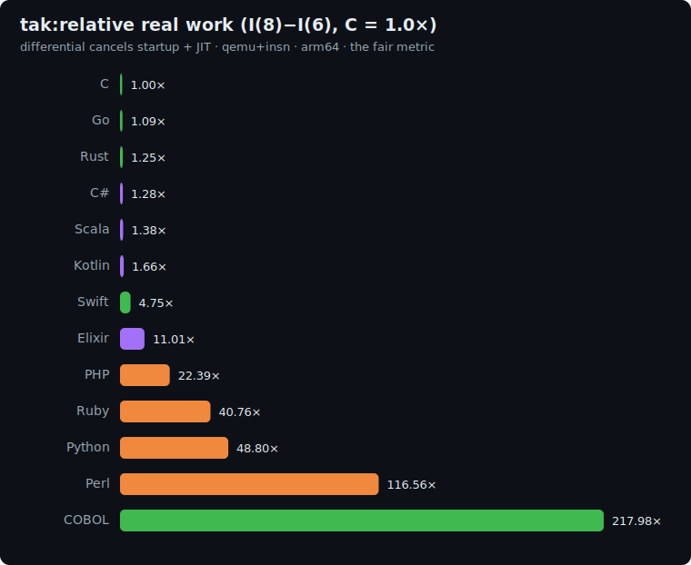

# tak: study

The **Takeuchi function** - the **function-call / recursion-overhead** axis of the suite.

Most benchmarks are dominated by memory, arithmetic, or allocation. `tak` is dominated by
*nothing but the call itself*: a naive, triply-recursive function that touches no arrays and
allocates nothing. Each non-base node makes three recursive calls; the only work per call is a
compare, a few decrements, and the call/return machinery. It isolates a dimension nothing else
in the suite measures (binary-trees recurses too, but its cost is heap allocation, not the call).

## The algorithm

```
tak(x, y, z):
    if y < x:  return tak( tak(x-1,y,z), tak(y-1,z,x), tak(z-1,x,y) )
    else:      return z
```

The size `n` maps to the classic shape `tak(3n, 2n, n)`. Every call is counted. Because all
three inner calls are arguments to the outer call, they are **always** evaluated (every language
here is eager / strict), so the call count is identical everywhere - it is the correctness
invariant. The returned value is the secondary check.

**Correctness invariant** (dual reference: C and Python independently produce these):

| n | shape | calls (line 1 checksum) | result (line 2) |
|---|---|--:|--:|
| 6 | `tak(18,12,6)` | `63609` | `7` |
| 8 | `tak(24,16,8)` | `2493349` | `9` |

Output contract: line 1 = the total number of calls; line 2 = `tak(n) = <result>`.

## Fairness rules

- **Naive** triple recursion exactly as above. **No memoization / caching**, no iterative or
  tail-call rewrite, no closed form - any of those changes the call count and is rejected by the
  gate. The point is to pay for every one of the millions of calls.
- Count **every entry** to `tak` (increment at function entry, before the base-case test).
- Pure **integer**; values stay tiny (no overflow, no float, no memory traffic) - the cleanest
  possible isolation of call cost, and deliberately free of the floating-point/decimal traps
  that distort other axes for some runtimes.
- No library/builtin that computes or accelerates the recursion.

## Representation per language

Most languages use a plain recursive function plus a module-level / static integer counter.
- **Elixir** is immutable: it carries the call count in an `:counters` reference (the same
  mutable-array convention the suite already uses for Elixir elsewhere), so the recursion stays a
  faithful triple call without threading an accumulator through every return.

## Sizes

`n1 = 6`, `n2 = 8`. The differential `I(8) - I(6)` isolates the marginal ~2.43M calls, cancelling
startup and any JIT warm-up.

## Results

Uniform qemu+insn pass, arm64, differential `I(8) - I(6)` normalized to **C = 1.0x**. Source:
[`results/2026-06-19-arm64-tak.json`](../../results/2026-06-19-arm64-tak.json). All 12 printed the
identical `2493349` call count (line 1) and `9` result (line 2).



| Language | I(6) | I(8) | differential | **vs C** (lower is better) | determinism |
|---|--:|--:|--:|--:|---|
| **C** | 1.4M | 50.4M | 49.0M | **1.00×** | exact |
| Go | 1.7M | 55.1M | 53.5M | 1.09× | jitter |
| Swift | 12.8M | 69.3M | 56.5M | 1.15× | exact |
| Rust | 1.8M | 62.9M | 61.2M | 1.25× | exact |
| C# | 207.6M | 270.1M | 62.6M | 1.28× | jitter |
| Scala | 634.4M | 701.8M | 67.4M | 1.38× | jitter |
| Kotlin | 156.3M | 237.7M | 81.4M | 1.66× | jitter |
| Elixir | 1.97B | 2.51B | 539.6M | 11.01× | jitter |
| PHP | 63.3M | 1.16B | 1.10B | 22.39× | exact |
| Ruby | 325.9M | 2.32B | 2.00B | 40.76× | jitter |
| Python | 103.2M | 2.50B | 2.39B | 48.80× | jitter |
| Perl | 160.6M | 5.87B | 5.71B | 116.56× | jitter |

The ordering is almost the **inverse** of the allocation/float axes: the compiled and JIT'd
languages collapse onto C (Go 1.09x, Swift 1.15x, Rust 1.25x, C# 1.28x, Scala 1.38x, Kotlin 1.66x) because a
function call is a few register moves and a branch, which every real compiler nails. The cost
shows up exactly where the call goes through an interpreter loop or a heavy runtime: PHP 22x,
Ruby 41x, Python 49x, Perl 117x (each call builds and tears down an interpreter stack frame).
Elixir's 11x is the BEAM's reduction-counted call. (Swift's 1.15x once read 4.75x: an implementation artifact where the
global call-counter forced a runtime exclusivity check on every call; threading it through an `inout`
parameter removed it, leaving Swift among the natives.)

**Readings:**
- **A function call is nearly free once compiled** (Go/Rust/C#/JVM within ~1.7x of C) and
  measurably expensive interpreted (tens to >100x C). It is the cleanest split between the two
  camps in the whole suite.
- **Determinism:** the natives (C, Rust, Swift) and PHP are bit-exact; the rest jitter.

## Reproduce

```bash
BENCH=tak scripts/bench-local.sh <lang>
python3 scripts/make_charts.py results/<date>-<isa>-tak.json
```
