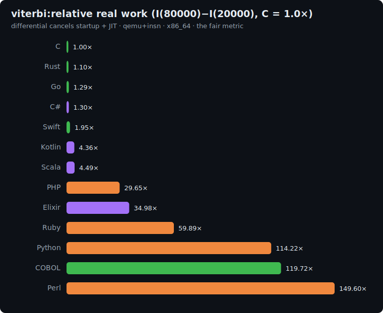

# viterbi: study

The sequence-inference axis of the suite: the **Viterbi algorithm**, the classical dynamic-programming
decoder for Hidden Markov Models and CRF-like sequence models. It is the dominant algorithm in speech
recognition, part-of-speech tagging, gene finding, and any system that reasons over a sequence of
discrete observations.

The shape of work is different from every other benchmark in the suite: a **loop-carried dependency
chain** through a 2D trellis, a **max-reduction** (argmax over S predecessor states) at every cell,
and a **pointer-chain backtrace** that materialises the most-probable path from the stored
back-pointers. None of those operations are independent across time steps — the forward pass is
strictly sequential in `t`, making auto-vectorisation across `t` impossible. Compilers can still
vectorise the inner argmax over S=8 states, but the outer sequential dependency chain is the
governing cost.

## The algorithm

```
S = 8   ALPHA = 4   P = 1000000007   T = size parameter

# LCG (glibc-style, seeded at 42)
state = (state * 1103515245 + 12345) & 0x7fffffff

# Draw order (PINNED — every language draws in exactly this order):
# 1. transition table trans[S*S] (row-major: trans[i*S+j])
for x in 0 .. S*S-1:   state=LCG(); trans[x] = state % 100 + 1

# 2. emission table emit[S*ALPHA]  (emit[j*ALPHA+sym])
for x in 0 .. S*ALPHA-1: state=LCG(); emit[x] = state % 100 + 1

# 3. observation sequence obs[T]
for t in 0 .. T-1:     state=LCG(); obs[t] = state % ALPHA

# Initialise column 0 (back-pointers at t=0 unused)
for j in 0..S-1:  vit[j] = emit[j*ALPHA + obs[0]]

# Forward trellis — max-plus semiring, pure integer
back[T*S]  # flat: back[t*S+j]
for t in 1 .. T-1:
    for j in 0 .. S-1:
        best = -1 ; bi = 0
        for i in 0 .. S-1:
            sc = vit_prev[i] + trans[i*S+j] + emit[j*ALPHA + obs[t]]
            if sc > best:       # STRICT > — lowest i wins ties
                best = sc ; bi = i
        vit_next[j] = best ; back[t*S+j] = bi
    swap(vit_prev, vit_next)

# Final state (STRICT > — lowest j wins ties)
bf = 0
for j in 1..S-1:
    if vit_prev[j] > vit_prev[bf]: bf = j

# Backtrace
path[T-1] = bf
for t in T-2 downto 0: path[t] = back[(t+1)*S + path[t+1]]

# Checksum
h = 0
for t in 0..T-1: h = (h*31 + path[t] + 1) % P
print h                                   # line 1 = primary checksum
print "viterbi(T) = <vit_prev[bf] % P>"  # line 2; trailing number = secondary
```

The primary checksum covers every decoded path label (shifted +1 so state-0 contributes). The
secondary is the optimal total path score mod P; it is a redundant correctness gate — a wrong
backtrace can accidentally produce the right hash, but it is far harder to produce the right score too.

**Correctness invariant:** every implementation prints the same primary checksum and secondary.

| T | primary checksum | secondary (optimal score % P) |
|---|---|---|
| 20000 | `276709012` | `3019915` |
| 80000 | `805821650` | `12079915` |

## Fairness rules

1. **No HMM/Viterbi library**: no `nltk`, `hmmlearn`, `pomegranate`, or any package that
   implements the trellis fill or backtrace. The explicit three-loop trellis (outer `t`, middle `j`,
   inner `i`) and the pointer-chain backtrace loop must appear verbatim in every implementation.
2. **Max-plus semiring, pure integer**: no log/exp, no float. Scores are integer sums; `trans` and
   `emit` entries are integers in 1..100; obs entries are in 0..ALPHA-1.
3. **Pinned tie-breaks**: both the inner argmax (`if sc > best` — STRICT >) and the final-state
   pick (`if vit_prev[j] > vit_prev[bf]` — STRICT >) use STRICT >, so the lowest index wins on
   a tie. Every language must match.
4. **Pinned LCG draw order**: trans drawn first (S*S values), then emit (S*ALPHA values), then obs
   (T values) — all from the same LCG state thread. The starting seed is 42.
5. **64-bit accumulators**: scores grow to ~T*200 ≈ 16M at n2 (fits int32), but all score
   variables and the hash accumulator `h` must be 64-bit to be safe.
6. **Flat `back` array**: `back[t*S+j]`, shape T*S, allocated upfront. No nested list-of-lists.

### Per-language representation

| Language | vit/score arrays | back | path |
|---|---|---|---|
| C | `long[S]` × 2 (double-buffer) | `int[T*S]` | `int[T]` |
| Rust | `Vec<i64>` × 2 | `Vec<i32>` | `Vec<i32>` |
| Go | `[S]int64` × 2 | `[]int32` | `[]int32` |
| Swift | `[Int]` × 2 | `[Int]` | `[Int]` |
| Python | `list` | `list` | `list` |
| Perl | `@array` | `@array` | `@array` |
| PHP | `array` | `array` | `array` |
| Kotlin | `LongArray` × 2 | `IntArray` | `IntArray` |
| Scala | `Array[Long]` × 2 | `Array[Int]` | `Array[Int]` |
| C# | `long[]` × 2 | `int[]` | `int[]` |
| Elixir | `:atomics` for vit_prev/vit_next/obs/back/path; LCG state + trans/emit threaded functionally |
| Ruby | `Array` |  |  |
| COBOL | `PIC S9(18) COMP-5 OCCURS` for scores/trans/emit; `PIC S9(9) COMP-5 OCCURS` for back/path/obs |

## Sizes

`n1 = 20000`, `n2 = 80000` (T = observation sequence length). The trellis has T*S = T*8 cells;
work per time step is S*S = 64 multiply-add-compares (the inner argmax). The differential
`I(80000) − I(20000)` isolates the marginal trellis cost from startup and JIT warm-up.

## Results: uniform qemu+insn pass

Single backend (`qemu-insn`), same ISA (arm64 local). Raw data in
[`results/2026-06-21-arm64-viterbi.json`](../../results/2026-06-21-arm64-viterbi.json).

### The fair metric: real work `I(80000) - I(20000)`, normalized to C = 1.0x (lower is better)

The absolute count includes the runtime's startup, which varies wildly across runtimes. The
differential between the two sizes cancels it (and JIT compilation), isolating the algorithm's real
work. C (gcc `-O2`, no GC) is the reference floor; below 1.0x beats C.



| Language | I(20k) | I(80k) | differential | **vs C** (lower is better) | determinism |
|---|--:|--:|--:|--:|---|
| Rust | 13.3M | 52.8M | 39.5M | **0.80×** | exact |
| **C** | 16.6M | 66.3M | 49.6M | **1.00×** | exact |
| C# | 242.5M | 306.3M | 63.8M | 1.29× | jitter |
| Go | 22.8M | 90.4M | 67.6M | 1.36× | jitter |
| Swift | 44.1M | 142.3M | 98.3M | 1.98× | exact |
| Kotlin | 246.3M | 358.2M | 111.9M | 2.26× | jitter |
| Scala | 721.1M | 835.4M | 114.3M | 2.30× | jitter |
| PHP | 581.3M | 2.22B | 1.64B | 33.03× | exact |
| Elixir | 2.72B | 4.47B | 1.74B | 35.16× | jitter |
| Ruby | 1.47B | 5.04B | 3.57B | 71.98× | jitter |
| Python | 1.73B | 6.79B | 5.06B | 102.04× | jitter |
| COBOL | 2.24B | 8.93B | 6.69B | 134.90×\* | exact (extrap.) |
| Perl | 2.69B | 10.7B | 8.03B | 161.86× | jitter |

## Reproduce

```bash
BENCH=viterbi scripts/bench-local.sh <lang>
```
