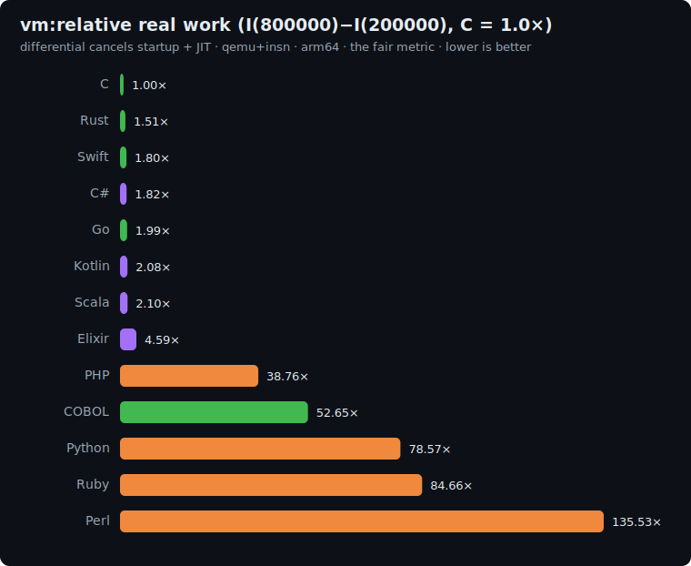

# vm: study

The control-flow / interpreter-dispatch axis: a tiny **stack-based bytecode virtual machine**. Its
hot path is the **dispatch loop** (fetch an opcode, branch to its handler, push/pop the stack), run
millions of times. This is the most *meta* benchmark in the suite: it measures the exact thing that
makes interpreted languages slow (interpreting), so it asks how fast each language can itself be an
interpreter.

## The algorithm

A fixed 40-int program (`PROG`, shared **verbatim** by every implementation) computes
`acc = (acc*31 + i*i) mod 2^32` over `i` in `0..N-1` with an explicit loop, and leaves `acc` on the
stack. The VM runs it; the checksum is `acc mod P`.

```
opcodes: 0 PUSH imm · 1 LOAD slot · 2 STORE slot · 3 ADD · 4 MUL · 5 SUB · 6 LT · 7 JZ addr · 8 JMP addr · 9 HALT
MASK = 0xFFFFFFFF   (ADD/SUB/MUL wrap mod 2^32)

PROG = [0,0, 2,0, 0,0, 2,1, 1,0, 1,2, 6, 7,37, 1,1, 0,31, 4, 1,0, 1,0, 4, 3, 2,1, 1,0, 0,1, 3, 2,0, 8,8, 1,1, 9]
       # i=0; acc=0; loop: if !(i<N) goto 37; acc=acc*31; acc+=i*i; i+=1; jmp loop; end: push acc; HALT

run(N):
    stack = [] ; locals = [0, 0, N] ; pc = 0          # locals = [i, acc, N]
    loop forever:
        op = PROG[pc]; pc += 1
        PUSH:  stack.push(PROG[pc]); pc+=1
        LOAD:  stack.push(locals[PROG[pc]]); pc+=1
        STORE: locals[PROG[pc]] = stack.pop(); pc+=1
        ADD:   b=pop;a=pop; push (a+b) AND MASK
        MUL:   b=pop;a=pop; push (a*b) AND MASK
        SUB:   b=pop;a=pop; push (a-b) AND MASK
        LT:    b=pop;a=pop; push (a<b)?1:0
        JZ:    c=pop; if c==0: pc=PROG[pc] else pc+=1
        JMP:   pc=PROG[pc]
        HALT:  return stack.top
print run(N) mod P                                     # line 1
print "vm(N)"                                          # line 2
```

**Correctness invariant:** every implementation runs the same program and prints the same result.

| N | checksum |
|---|---|
| 200000 | `350689618` |
| 800000 | `234207083` |

## Fairness rules

1. **Hand-written dispatch loop**: an explicit fetch/branch over the opcodes (a `switch`, `if`-chain
   or jump table). **No** `eval`, no runtime code generation, no JIT-from-bytecode trick: the program
   must be *interpreted*, opcode by opcode.
2. **The exact `PROG` array** (embedded verbatim) and the exact opcode semantics; `locals = [0,0,N]`.
3. **64-bit VM values** (stack + locals): the `MUL` product is taken before masking, so values must
   hold up to ~`2^40`, so use `long`/`i64`/`Long`. `ADD`/`SUB`/`MUL` mask to 32 bits.
4. All integer.

### Per-language representation

| Language | Stack / locals |
|---|---|
| C | `long[]` |
| Rust | `Vec<i64>` / array |
| Go | `[]int64` |
| Swift | `[Int]` |
| Python | `list` |
| Perl | `@array` |
| PHP | `array` |
| Kotlin | `LongArray` |
| Scala | `Array[Long]` |
| C# | `long[]` |
| Elixir | a list/tuple stack threaded through recursion (state is tiny) |
| Ruby | `Array` (`[]`) stack + locals; values masked `& 0xFFFFFFFF` |

## Sizes

`n1 = 200000`, `n2 = 800000` loop iterations (each ≈ 15 dispatched opcodes). The differential
`I(800000) − I(200000)` is dominated by the marginal dispatch + stack work.

## Results

Uniform qemu+insn pass, **arm64**, median of 5, differential `I(800000) − I(200000)` normalized to
**C = 1.0×**. Source: [`results/2026-06-17-arm64-vm.json`](../../results/2026-06-17-arm64-vm.json).
All 12 ran the same program and printed the identical `350689618` / `234207083` results.



| Language | I(200k) | I(800k) | differential | **vs C** (lower is better) | determinism |
|---|--:|--:|--:|--:|---|
| **C** | 54.9M | 219.3M | 164.4M | **1.00×** | exact |
| Rust | 83.0M | 331.4M | 248.4M | 1.51× | exact |
| Swift | 110.1M | 406.5M | 296.4M | 1.80× | exact |
| C# | 312.4M | 612.4M | 300.0M | 1.82× | jitter |
| Java | 286.8M | 608.1M | 321.3M | 1.95× | jitter |
| Go | 109.3M | 436.3M | 327.0M | 1.99× | jitter |
| Kotlin | 326.0M | 667.8M | 341.8M | 2.08× | jitter |
| Scala | 810.0M | 1.16B | 345.5M | 2.10× | jitter |
| Elixir | 2.28B | 3.04B | 754.4M | 4.59× | jitter |
| JavaScript | 449.4M | 1.40B | 955.4M | 5.81× | jitter |
| PHP | 2.16B | 8.53B | 6.37B | 38.76× | exact |
| Python | 4.35B | 17.3B | 12.9B | 78.57× | jitter |
| Ruby | 4.92B | 18.8B | 13.9B | 84.66× | jitter |
| Perl | 7.44B | 29.7B | 22.3B | 135.53× | jitter |

### The headline: an interpreter interpreting an interpreter, and Elixir's surprise

The compiled and JIT'd languages bunch tightly (1.5–2.1×): a `switch` over ten opcodes plus a stack
push/pop is exactly the kind of small, predictable dispatch loop every backend optimizes well. The
standout is **Elixir at 4.59×, its second-best result in the entire suite** (only binary-trees,
0.30×, beats it). The dispatch is a recursive function whose body **pattern-matches on the opcode**,
and pattern-matching is the BEAM's native idiom, so its "interpreter loop" is far cheaper than its
imperative array work (it is 36–56× on sort-search and dijkstra). The interpreters (PHP 39×, Python
79×, Perl 136×) are *interpreting a bytecode in a language that is itself interpreted*, yet they land
below their compute-axis multipliers, because each opcode is only a handful of their own bytecodes.

## Reproduce

```bash
BENCH=vm scripts/bench-local.sh <lang>
```
