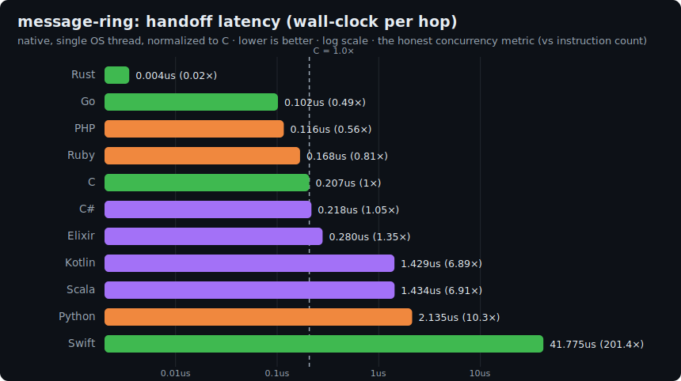
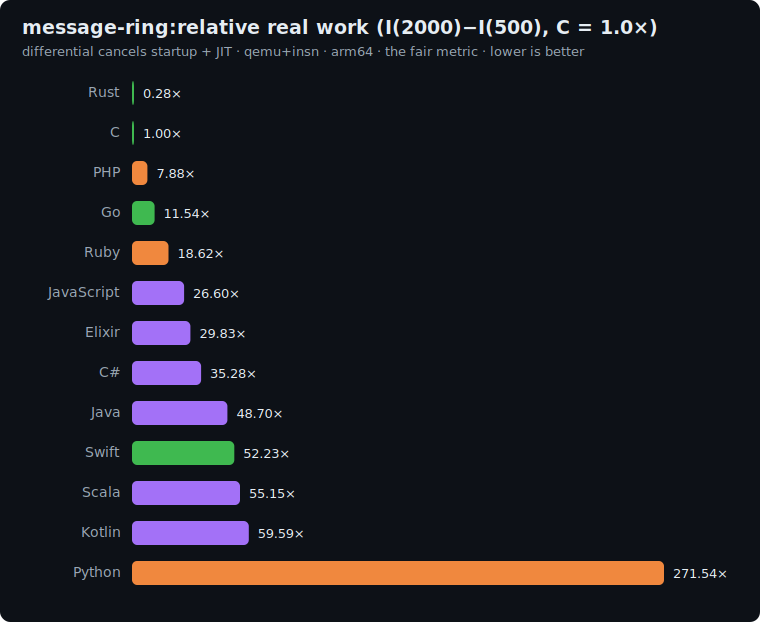

# Concurrency in lang-lab: a reproducible study

How much does concurrency *cost*, and how well does each language *use multiple cores*, measured
the lang-lab way: reproducibly, on free shared CI, with no dedicated hardware. This study does not
try to be a server benchmark. It decomposes "concurrency" into the facets that can be measured
**objectively and reproducibly** here, and is explicit about the ones that cannot (see
[What this does not measure](#what-this-does-not-measure)).

Coverage: 12 languages. COBOL has no concurrency primitive and sits the whole study out. Perl has
no core *cooperative* primitive, so it participates in scalability (Axis 2, via `fork`) but is N/A
for primitive overhead (Axis 1).

## The three axes

Concurrency is not one number. Three different, reproducible questions:

| Axis | Question | Backend | Reproducibility | Better |
|---|---|---|---|---|
| **1. Primitive cost** | How long is one cooperative handoff (and how much machinery does it run)? | wall-clock per hop + qemu+insn | ratio / bit-exact | **lower** |
| **2. Parallel scalability** | How well does parallelizable work scale to more cores? | wall-clock ratio `T1/TP` (native) | ratio, stable to ±0.03 | **higher** |
| **3. Real vs fake parallelism** | Does the runtime actually use cores, or does a GIL/GVL serialize it? | wall-clock `T1/TP`, threads vs processes | ratio | **higher** |

Direction in one line: Axis 1 is **lower is better** (cheaper machinery per operation); Axes 2 and 3
are **higher is better** (more speedup, closer to the ideal Nx).

Axis 1 is deterministic because counting guest instructions is machine-independent. Axes 2 and 3
are wall-clock, but reported as a **ratio** (time at 1 core over time at P cores) measured
back-to-back in the same run, which cancels machine-speed noise and stays stable even on shared CI.
That is what makes a concurrency study possible without dedicated hardware.

---

## Axis 1: concurrency-primitive cost

A handoff has two costs worth separating: **how long it takes** (wall-clock, what actually matters)
and **how many instructions it runs** (machinery weight). On this benchmark they disagree sharply,
and the disagreement is the whole point. The [`message-ring`](../benchmarks/message-ring/README.md)
benchmark threads a token through a ring of 32 cooperative workers; each language uses its idiomatic
single-OS-thread primitive, so this isolates one handoff, not parallel speedup.

### Wall-clock per hop (the honest concurrency metric; normalized to C; lower is better)

| Language | Primitive | us/hop | vs C |
|---|---|--:|--:|
| **Rust** | hand-rolled `Future` poll-loop | 0.004 | **0.02x** |
| **Go** | goroutines + channels | 0.102 | **0.49x** |
| **PHP** | `Fiber` | 0.116 | **0.56x** |
| **Ruby** | `Fiber` | 0.168 | **0.81x** |
| **C** | `ucontext` / `swapcontext` | 0.207 | **1.00x** |
| C# | `async`/`await`, single-thread ctx | 0.218 | 1.05x |
| Elixir | BEAM processes + send/receive | 0.280 | 1.35x |
| Kotlin | JVM virtual threads | 1.43 | 6.89x |
| Scala | JVM virtual threads | 1.43 | 6.91x |
| Python | `asyncio` | 2.14 | 10.30x |
| Swift | `CheckedContinuation` (`@MainActor`) | 41.8 | 201x |
| Perl | N/A (no core cooperative primitive) | N/A | N/A |



Measured natively (no qemu), single OS thread, as the differential of two sizes (cancels startup),
min of repetitions, normalized to C (a ratio, so machine speed cancels). Not bit-reproducible like
the instruction track; treat the ratios as approximate (roughly ±15%). **Go, PHP and Ruby beat C**,
and Elixir and C# are on par. Swift is the outlier: its `@MainActor` continuation hops route through
libdispatch's main queue, about 40us each.

### Instruction count per hop (machinery weight, NOT latency, and syscall-blind)

| Language | Primitive | insns/hop | vs C |
|---|---|--:|--:|
| **Rust** | `Future` poll-loop | 34 | **0.28x** |
| **C** | `ucontext` / `swapcontext` | 123 | **1.00x** |
| PHP | `Fiber` | 974 | 7.88x |
| Go | goroutines + channels | 1427 | 11.54x |
| Ruby | `Fiber` | 2301 | 18.62x |
| Elixir | BEAM processes | 3688 | 29.83x |
| C# | single-thread `async` | 4362 | 35.28x |
| Swift | `CheckedContinuation` | 6458 | 52.23x |
| Scala | JVM virtual threads | 6819 | 55.15x |
| Kotlin | JVM virtual threads | 7369 | 59.59x |
| Python | `asyncio` | 33578 | 271.54x |



**Why the two columns disagree (and why instruction count misleads here).** The qemu+insn backend
counts *user-space guest instructions* but is blind to syscall cost (a `svc` trap is one instruction;
the kernel work behind it is invisible). C's `swapcontext` does ~2 `rt_sigprocmask` syscalls per hop
(132,032 in a 2000-lap run) to save and restore the signal mask: nearly free in instructions, real
kernel round-trips in wall-clock. So the instruction column flatters C to 1.0x. Go and the BEAM do
every handoff in user space (Go executes just 192 syscalls in an entire run), so all of their work is
counted. The very design that makes goroutines and BEAM processes fast (a user-space scheduler that
never traps to the kernel per switch) is exactly what inflates their instruction count. **Read the
instruction column as "how much user-space machinery the primitive runs," not "how slow it is."** For
"how good is this language at concurrency," the wall-clock column above is the honest one. (For the
other 18 benchmarks syscalls are a negligible fraction of the work, even allocation-heavy ones like
binary-trees, where `malloc` triggers only a handful of `mmap`/`brk` calls per thousands of
allocations; so the instruction metric stays a faithful proxy there. The blindness only distorts the
ranking when a syscall sits on the critical path of every operation, as it does for a context switch.)

---

## Axis 2: parallel scalability (wall-clock speedup at 4 cores, higher is better)

For the five embarrassingly-parallel compute kernels, the [scaling track](scaling-track.md) measures
the wall-clock speedup `T1/TP` of the compute region, run natively, at 1/2/4 cores. Each language
uses its real-parallel primitive (threads, goroutines, processes, BEAM tasks, JVM/CLR pools). Higher
is closer to the ideal 4x.

| Language | gemm | mandelbrot | blur | k-means | gbdt | **mean** |
|---|--:|--:|--:|--:|--:|--:|
| C | 3.53 | 2.50 | 3.49 | 3.15 | 3.41 | **3.21** |
| Rust | 3.53 | 2.48 | 3.50 | 3.39 | 3.51 | **3.28** |
| Go | 3.58 | 2.47 | 3.63 | 3.15 | 3.21 | **3.21** |
| Swift | 3.70 | 2.45 | 3.46 | 2.82 | 3.18 | **3.12** |
| Python (proc) | 3.61 | 2.49 | 3.12 | 2.49 | 3.67 | **3.08** |
| Perl (fork) | 2.21 | 2.67 | 2.94 | 3.07 | 3.79 | **2.94** |
| PHP (fork) | 4.08 | 2.51 | 2.58 | 2.45 | 3.90 | **3.10** |
| Ruby (fork) | 3.52 | 2.54 | 3.14 | 3.38 | 3.74 | **3.26** |
| Kotlin | 3.46 | 2.46 | 2.65 | 2.86 | 2.90 | **2.86** |
| Scala | 3.60 | 2.44 | 3.31 | 2.85 | 4.20 | **3.28** |
| C# | 3.76 | 2.50 | 3.66 | 3.35 | 3.32 | **3.32** |
| Elixir | 3.61 | 2.56 | 3.53 | 3.25 | 3.75 | **3.34** |

Per-benchmark speedup charts: [gemm](charts/gemm-scaling.svg) · [mandelbrot](charts/mandelbrot-scaling.svg) · [blur](charts/blur-scaling.svg) · [k-means](charts/k-means-scaling.svg) · [gbdt](charts/gbdt-scaling.svg).

**How to read this.** Given a parallelizable kernel, **almost every runtime reaches ~3x at 4
cores**, and the spread between languages is small (means cluster in 2.9 to 3.3x). The takeaway is
the opposite of Axis 1: parallel *scalability* is mostly a property of the algorithm and the OS,
not of the language, once you use a real parallel primitive. Two reading notes:

- **mandelbrot sits at ~2.5x for everyone.** That is load imbalance, not a language trait: the
  center rows iterate the full escape limit while edge rows bail early, so a contiguous row-band
  split hands some workers much more work. It is the same for all 12 languages, which is exactly why
  it is safe to attribute it to the algorithm.
- **Scala gbdt 4.20x is super-linear**, the usual min-of-5 + cache effect at a modest size, within
  the noise floor of a ratio metric.

---

## Axis 3: real parallelism vs GIL/GVL (higher is better; ~1.0x means serialized)

Some runtimes serialize CPU-bound threads (CPython's GIL, MRI Ruby's GVL). The only fair CPU-parallel
primitive there is **processes**. `gemm` measured both for Python:

| Python primitive | speedup @ 4 cores |
|---|--:|
| processes (`multiprocessing`) | **3.61x** |
| threads (`threading`) | **1.03x** |

The threads line flat at ~1.0x is the GIL made visible: four threads, one core's worth of work. It
is not a measurement bug, it is the truth of the runtime. This is why Axis 2 uses **processes** for
Python and Ruby (and `fork` for Perl/PHP): it is the only way those runtimes get real parallelism on
CPU work, at the cost of inter-process communication.

---

## Per-language synthesis

Overhead = Axis 1 (vs C). Scalability = Axis 2 mean @4c. Together they say "cheap machinery?" and
"uses the cores?", which are independent.

| Language | Handoff cost (wall, vs C, lower better) | Scalability (higher better) | Real parallelism via | One-line read |
|---|--:|--:|---|---|
| **C** | 1.00x | 3.21 | OS threads (pthreads) | Baseline; its `swapcontext` does a kernel syscall per switch (cheap in instructions, not free in time). |
| **Rust** | **0.02x** | 3.28 | OS threads (`std::thread`) | Fastest handoff and strong scaling; its switch is a bare state-machine poll. |
| **Go** | **0.49x** | 3.21 | goroutines | Faster handoff than C; its high instruction count is user-space scheduling, not slowness. |
| **Swift** | 201x | 3.12 | OS threads | Slowest handoff by far (main-actor continuations via libdispatch, ~40us/hop). |
| **Python** | 10.30x | 3.08 | **processes** | Slow `asyncio` handoff; real parallelism only via processes (threads = 1.0x). |
| **Perl** | N/A | 2.94 | `fork` | No core cooperative primitive; parallel compute only via processes. |
| **PHP** | **0.56x** | 3.10 | `fork` | Fast fiber handoff (beats C); real CPU parallelism via process fork. |
| **Ruby** | **0.81x** | 3.26 | **processes** | Fast fiber handoff (beats C); GVL means processes for real parallelism. |
| **Kotlin** | 6.89x | 2.86 | JVM threads | Virtual-thread handoff is genuinely slow in wall-clock too; scaling a touch lower. |
| **Scala** | 6.91x | 3.28 | JVM threads | Same JVM model as Kotlin, stronger mean scaling. |
| **C#** | 1.05x | 3.32 | CLR threads | Handoff on par with C; top-tier scaling. |
| **Elixir** | 1.35x | 3.34 | BEAM processes | Handoff roughly on par with C in wall-clock; buys isolation + supervision; best mean scaling. |

**The headline.** Three independent truths. (1) **Concurrency-primitive cost** depends on which
metric you trust: by instruction count the spread is ~1000x and looks brutal for Go and Elixir, but
in wall-clock (what actually matters) Go, PHP and Ruby beat C while Elixir and C# are on par, because
the instruction metric is blind to the kernel syscalls C's coroutine leans on. (2) **Parallel
scalability** of a parallelizable kernel barely differs across languages (Axis 2, all ~3x). (3) The
GIL/GVL (Axis 3) is a hard, visible line that dictates *which*
primitive a language must use to be parallel at all.

---

## What this does not measure

Read these numbers for what they are. This study does **not** measure, and cannot measure
reproducibly without dedicated hardware:

- **Latency / throughput under real load** (a server doing N concurrent requests). That is wall-clock
  on real hardware with a defined workload, the opposite trade-off from lang-lab's reproducibility.
- **Tail latency (p99)**, which often matters more than mean throughput and can rank languages
  differently.
- **Lock / atomic contention and shared-memory scaling.** Contended synchronization jitters under
  qemu and aliases the plugin's per-vCPU counters, so it is not measured here.
- **Async I/O**, back-pressure, and event-loop behavior under real I/O. These kernels are pure CPU.
- **Absolute speed.** Axis 1 counts instructions, not nanoseconds: more instructions per hop does not
  mean slower wall-clock per hop.

And the deeper caveat: "best at concurrency" is not an objective question in the abstract. It depends
on the workload (throughput vs tail latency, CPU- vs I/O-bound, contention level) and on what you
optimize for. This study answers three specific, reproducible questions; it does not crown a winner.

## Reproduce

```bash
# Axis 1 (overhead, instructions):
BENCH=message-ring scripts/bench-fast.sh c go rust swift python php ruby kotlin scala csharp elixir
python3 scripts/make_charts.py results/<date>-<isa>-message-ring.json

# Axes 2 and 3 (scalability + threads-vs-processes, wall-clock):
#   the scaling track runs each <bench>-par natively at 1/2/4 cores; see scaling-track.md.
python3 scripts/make_scaling_charts.py results/scaling/<date>-<isa>-<bench>.json
```
